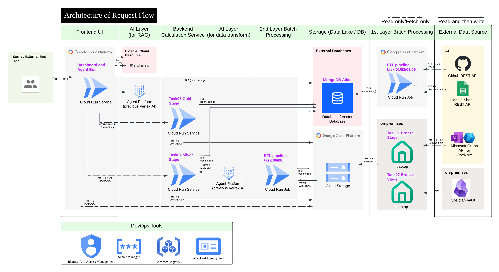

# 個人技能演進看版 × 具追溯性保證之知識庫文件檢索系統  × 知識檢索 Agent


  \


## About

**Personnel Skill Library** 是一套以資料工程手法打造的**個人技能看板**：把散落在多個平台的學習與工作足跡（Obsidian／OneNote 筆記、GitHub、LeetCode／ccClub 刷題、Google Sheet 個人 KPI 統整表）透過多條 ETL pipeline 匯整進 MongoDB Atlas 與 GCS 資料湖，再以 Streamlit 呈現技能雷達、專案架構、資料管線健康度等頁面，最後串接一個以向量檢索為基礎的 **AI 知識 Agent**，用自然語言查詢知識庫。

**運作概念**：運行 7 支 data pipelines，其中有 4 支中型資料管道 [task01](#feature)、[task06](#feature)、[task07](#feature)、[task08](#feature)，以資料的 hash 演算結果保證管道重試時的冪等性 (idempotency)，以 data pipeline 程式腳本大量強調資料血緣的可追溯性，保護向量檢索庫指向 single truth，亦是本專案所希望強調的資料治理品質。這類 data pipeline 採用 **Bronze、Silver、Gold** medallion 架構為每段腳本的資料產出品質分層設計，Silver 層之後為乾淨的知識文檔 (筆記)，Gold 層則以一個預設的工作流程將乾淨文檔執行歸檔任務後，自動執行向量化，供 RAG Agent 檢索。  \
RAG 檢索系統是透過 Python-Streamlit 製成的介面來與使用者互動，並實作前後端服務讀寫權限分離，避免資料表誤改、誤刪等污染風險。各 data pipelines 與前端介面的實作引導連結，詳見 [Feature Table](#feature)。

> [Live Demo](https://dashboard-ui-219985522999.asia-east1.run.app)

## Feature

每個子資料夾都是一塊可獨立執行的功能，並附專屬 README 說明資料來源、schema 與啟動方式：

| 功能 | 說明 | README |
| ---- | ---- | ------ |
| Obsidian Medallion ETL | Obsidian 筆記 CDC 增量清洗、歸檔、軟刪除、快照 | [task01_obsidian_etl_v2](./task01_obsidian_etl_v2/README.md) |
| GitHub ETL | 抓取 owner／collaborator repo 與本人 commit、README 摘要 | [task02_github_restapi_etl](./task02_github_restapi_etl/README.md) |
| LeetCode + ccClub ETL | 兩平台刷題紀錄與難度／主題統計 | [task03_leetcode_ccClub_etl](./task03_leetcode_ccClub_etl/README.md) |
| Skill Radar ETL | Google Sheet 技能盤點加權計分為雷達軸層級 | [task05_googlesheet_skill_etl](./task05_googlesheet_skill_etl/README.md) |
| Obsidian 向量化 | 歸檔筆記多模態切塊向量化 | [task06_obsidian_embed_etl_v2](./task06_obsidian_embed_etl_v2/README.md) |
| OneNote Bronze ETL | Graph API 下載 HTML、`dt=` 分區多版本存 GCS | [task07_onenote_to_markdown_lazy_loading](./task07_onenote_to_markdown_lazy_loading/README.md) |
| OneNote Silver 服務 | on-demand 多模態 LLM enrich 與快取機制 | [task07_silver_service](./task07_silver_service/README.md) |
| OneNote Gold 服務 | 人工核可後歸檔 / 退件、回寫品質欄位 | [task07_gold_service](./task07_gold_service/README.md) |
| OneNote 向量化 | 歸檔筆記多模態切塊向量化 | [task08_onenote_embed_etl](./task08_onenote_embed_etl/README.md) |
| Dashboard UI | 六頁 Streamlit 看板 (含 RAG 檢索問答服務入口) | [dashboard_ui](./dashboard_ui/README.md) |


## Tech Stack

| Layer | 技術 | 目的 |
| ----- | ---- | ---- |
| 01 Frontend | Streamlit、Plotly、Pandas、CSS (`st.markdown`) | 多頁看板、互動圖表與版面 |
| 02 APIs & Backend Logic | Flask、GitHub REST／LeetCode GraphQL／Microsoft Graph／Google Sheets API、BeautifulSoup4、Requests、RapidFuzz | Silver/Gold 服務端點與各來源資料抓取／解析 |
| 03 Database & Storage | MongoDB Atlas、GCS、Atlas Vector Search、PyMongo | 文檔資料庫、資料湖、向量檢索索引 |
| 04 Auth & Permissions | GCP Workload Identity Federation、Service Account、MSAL (Azure OAuth)、Google OAuth、GitHub PAT、Cookie 驗證 | CI/CD 與各服務／來源的身分驗證 |
| 05 Hosting & Deployment | Cloud Run Service／Job、Artifact Registry、Docker | 容器化與雲端執行 |
| 06 Cloud & Compute (AI/ML) | Google Cloud Platform、Agent Platform（Gemini）、Cohere、LangChain | LLM enrichment、多模態向量化、切塊與重排序 |
| 07 CI/CD & Version Control | Git、GitHub Actions、多分支策略、Poetry、pyenv | 自動 build/push/deploy（Cloud Run Job）與環境管理 |
| 08 Security | GCP Secret Manager、pre-commit hooks、python-dotenv、Claude Code hooks | 機密管理與提交前防護 |
| 09 Rate Limiting & Flow Control | LLM 斷路器、Incremental loads、Lazy Loading／on-demand 觸發 | 保護外部 API、只處理變更、tokens 消耗量管制 |
| 10 Caching | `st.cache_resource`、`sha256 hash`、`md5 hash` | 減少重算與重複 LLM 呼叫、防競態 |
| 11 Scaling | Cloud Run 自動擴展、微服務拆分（:8002／:8003） | 水平擴展與權限／部署隔離 |
| 12 Error Tracking & Logs | Ruff、Loguru、`onenote graph api logs`、`multimodal LLM calling logs` | 結構化日誌、API/LLM 稽核、靜態檢查 |
| 13 Availability & Recovery | Upsert 手法 | 可重跑、可稽核、可回溯 |


## Architecture



## Project Structure

```plaintext
personnel_skill_library/            # 專案根目錄
├── task01_obsidian_etl_v2/            # Obsidian medallion ETL
│   ├── silver_transform_markdown/     #   CDC gate → 清洗 → 歸檔 → upsert → 軟刪除
│   └── gold_notes_metadata_snapshot/  #   notes_summary 快照
├── task02_github_restapi_etl/         # GitHub ETL
├── task03_leetcode_ccClub_etl/        # LeetCode + ccClub ETL
├── task05_googlesheet_skill_etl/      # Skill Radar ETL
├── task06_obsidian_embed_etl_v2/      # Obsidian 向量化
├── task07_onenote_to_markdown_lazy_loading/  # OneNote Bronze ETL（地端）
├── task07_silver_service/             # OneNote Silver enrich 服務（:8002）
├── task07_gold_service/               # OneNote Gold 歸檔/退件服務（:8003）
├── task07_common/                     # 三服務共用工具（gcs/audit_log/hashing/topic）
├── task08_onenote_embed_etl/          # OneNote 向量化
├── dashboard_ui/                      # Streamlit 看板 + AI Agent
│   ├── pages/                         #   五個子頁（HOME 為 app.py）
│   ├── agents/                        #   intent_router / rag / planning
│   ├── agent_tools/                   #   query rewriter / 向量搜尋 / reranker / chat_history
│   └── utils/                         #   MongoDB 查詢 / 繪圖 / GCS 讀取
├── docker/                            # 各 task 與 dashboard 的 Dockerfile
├── doc/                               # 分支摘要、schema 定義、README 模板
├── openspec/                          # OpenSpec 變更流程
├── tests/                            # unittest（全 mock，不連外部服務）
├── env/                              # service account JSON keys（不進 git）
├── pyproject.toml / poetry.lock       # Poetry 依賴
└── CLAUDE.md                          # Claude Code 專案指引
```

## Get Started

### 1. Clone 與環境建置

先 clone：

```bash
git clone -b main --single-branch --depth 1 https://github.com/Jessie-Lin-810630/personnel_skill_library.git

cd personnel_skill_library
```

依照使用目的擇一路徑：

#### 路徑 A — Guest：只想用 Docker 快速跑其中一支 task

適合不打算參與開發、只想跑單一 task 看結果的人。只需要 Docker，本機不必裝 Python／Poetry。

1. 備妥該 task 需要的環境變數，寫進專案根目錄 `.env`（見 [第 2 節](#2-環境變數與外部設定)）。
2. build 並執行該 task 的 image，見 task 各自的 [README.md](#feature) 章節「Run on-premise with Docker Container」：
    ```bash
    docker build -f docker/Dockerfile.task02 -t task02:latest .
    docker run --rm --env-file ./.env task02:latest
    ```

> task07 Bronze 需互動式瀏覽器授權，目前僅設計為地端直接執行、無 Docker（見其 [README.md](./task07_onenote_to_markdown_lazy_loading/README.md)）。

#### 路徑 B — Developer：完整重現開發環境（pyenv + Poetry）

適合想完整重現作者環境、參與開發者。

- (非必要) 如您的機器沒安裝 python 3.14.x 版本，建議使用 pyenv 安裝。
    ```bash
    pyenv install 3.14.2
    ```

- 找尋 pyenv 把 python 3.14.2 安裝在哪
    ```bash
    for v in $(pyenv versions --bare); do echo "$(pyenv root)/versions/$v/bin/python"; done
    ```
    執行以上指令後您可能會看到至少一行這種結構的路徑字串：
    ```bash
    /.../.../.pyenv/versions/3.12.8/bin/python
    /.../.../.pyenv/versions/3.14.2/bin/python
    ```

- (非必要) 如您的機器尚未安裝 poetry 套件管理工具，參考[官方指令安裝 poetry](https://python-poetry.org/docs/#installing-with-the-official-installer).

- 鎖定 poetry 使用 python 3.14 建立虛擬環境
    ```bash
    poetry env use <the-path-to-python-3.14-by-pyenv>
    ```

- 建立並啟用虛擬環境
    ```bash
    poetry install --no-root
    poetry shell
    ```

---

### 2. 環境變數與外部設定

```bash
cp .env.example .env      # cp 後於 .env 填入真實值
```
- .env.example 變數大致上有:
    - **資料庫**：在 [MongoDB Atlas](https://www.mongodb.com/atlas) 建立免費叢集、database user 與 Network Access，把連線字串填入 `MONGO_ALTAS_URI`、資料庫名填 `MONGO_DB_NAME`（本專案統一預設 skill_dashboard）。向量搜尋另需在 Atlas Console 手動建立 Vector Search index（見 task06／task08 README）。
    - **雲端 JSON 憑證**：若您在*地端*運行任一 task，建議將 task 所需要的雲端服務帳戶 (各 service account) 的 JSON key 放在 `./env/`（如 `env/gcs-user.json`、`env/agent-platform-user.json`），並在 `.env` 以獨立變數指向憑證檔案路徑。
    - 其餘專屬單一 task 的環境變數，建議直接詳見各自 [README.md](#feature) 的 Configuration 節。

### 3. 執行

```bash
# 跑一支 ETL（以 task02 為例）
poetry run python -m task02_github_restapi_etl.main

# 啟動 streamlit app
poetry run streamlit run dashboard_ui/app.py

# flask service called by OneNote review page of streamlit app
poetry run python -m task07_silver_service.app
poetry run python -m task07_gold_service.app

# 執行全部測試
poetry run python -m unittest discover -s tests
```

各 task／dashboard 的 Docker 與 Cloud Run 部署方式，見各自 README 的 Get Started。

### 4. （選用）OpenSpec 變更流程

本專案以 [OpenSpec](https://github.com/Fission-AI/OpenSpec) 管理規格變更。若要沿用：

```bash
npm install @fission-ai/openspec@latest
```

```bash
openspec update
```

```bash
openspec init
```

### 5. （選用）以 Claude Code 接手開發

在 repo 根目錄直接啟動 `claude`，即會自動載入根目錄的 [`CLAUDE.md`](./CLAUDE.md)（專案指引：ETL 命名規則、module docstring 規範、各 task 的資料流與 schema 指路）作為 context。


## What's Next?

- [ ] **AI Knowledge Agent 的 OAuth2 驗證**：`dashboard_ui/pages/ai_knowledge_agent.py` 目前登入控管僅粗分4層帳號，可計畫加入 OAuth2（Google）驗證，區分可查詢個人知識庫的身分。
- [ ] **告警機制**：Cloud Run Job 執行 ETL 遇 4xx/5xx 時捕捉例外並發送通知（Email／Pub/Sub）。
- [ ] **淘汰 v1 過渡並寫**：task01 v2 過渡期同時並寫 v1 `obsidian_summary`，待 backfill 到 `notes_summary` 後淘汰。
