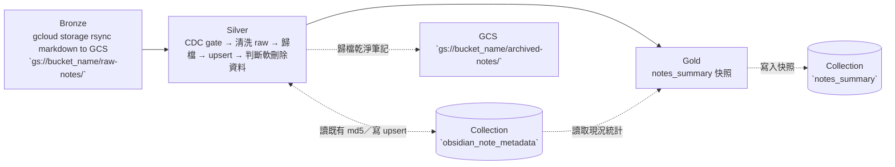

# Task01 v2 — Obsidian Vault Medallion ETL

> 本文件是 **task01 v2 專用的執行指引**，補足專案根目錄 high-level [`README.md`](../README.md) 未涵蓋的實作細節。
> 環境安裝的「共用前置」（pyenv + Poetry、MongoDB Atlas 帳號、Docker Desktop）請見根目錄 [`README.md`](../README.md)；本文只寫 task01 v2 自己要準備的東西與執行步驟。


# Purpose

- 掃描存在於 GCS 裡面、屬於 Obsidian 筆記軟體寫成的原始筆記（markdown 檔 (.md) 與引用的圖片 (.png 等)）清單，挑出新增或變更的筆記，取得其內容與引用的圖片。
- 清洗出每份筆記的中繼資料，至少包含: frontmatter、圖片附件連結、筆記分類、內文標籤，並歸檔一包乾淨的檔案回 GCS。最後對被移除的原始筆記標記為軟刪除。
- 將中繼資料、歸檔路徑、軟刪除狀態寫入 MongoDB Atlas 的 `obsidian_note_metadata`。
- 對中繼資料現況做定期快照，寫入 MongoDB Atlas 的`notes_summary`，供 dashboard 首頁與後續的向量化（task06 v2）任務使用。


# Table of Contents
- [Purpose](#purpose)
- [DataFlow](#dataflow)
- [Project Structures](#project-structures)
- [Configuration](#configuration)
- [Schema of Collections (Tables) in Database of MongoDB Atlas](#schema-of-collections-tables-in-database-of-mongodb-atlas)
- [Data Source](#data-source)
- [Get Started](#get-started)
  - [(Option 1) Run on-premise without Docker Container](#option-1-run-on-premise-without-docker-container)
  - [(Option 2) Run on-premise with Docker Container](#option-2-run-on-premise-with-docker-container)
  - [(Option 3) Run by Cloud Run Job](#option-3-run-by-cloud-run-job)


# DataFlow

task01 v2 使用 **Bronze → Silver → Gold** medallion 架構為任務分層，各層有自己的 ETL 階段。Bronze 層任務在本地機器直接執行資料上傳/同步即可。Silver 與 Gold 層任務由 `main.py` 作為主程式入口串聯執行二層的 ETL 步驟。



- **Bronze**：以 gcloud storage rsync 指令將本機  Obsidian vault 的筆記檔案與圖片同步到 GCS `raw-notes/` 下。建議 bucket 可開 Object Versioning 控制。
- **Silver**：掃描 GCS 挑出新增或變更檔、清洗筆記內文、歸檔乾淨筆記、整合資料血緣等中繼資料、軟刪除判斷。
    - **Extract**：利用 CDC 機制挑出新增或變更筆記
        - 掃描 GCS 的 `raw-notes/` 取出所有筆記與圖片的 md5 hash 值。接著從 DB 讀取上一次任務執行所記下的筆記與圖片 md5 hash 值。找到 hash 值不一致的檔案，下載筆記原始檔 (`.md` 檔案)。
    - **Transform**：清洗筆記內文、歸檔乾淨筆記、整合資料血緣等中繼資料
        - 將下載之筆記內文內文錯位的 frontmatter 復歸正確位置。
        - 分類出 note type、topic、note tags、created date 等，並解析 wiki link 語法萃取出引用的圖片名稱與連結。這些是筆記的資料血緣、亦是資料特徵。
    - **Load**：將乾淨的筆記內文連同引用的圖片歸檔後、整併資料血緣資料列寫入 database。
        - 寫入新的 .md 與檔案到 GCS 另一層 `archived-notes/` 與 `raw-notes/` 的檔案區隔。
        - 寫入後同時取回新檔案的 md5 hash 值，將 transform 階段分類出的 note type、topic、note tags、created date 等資料血緣，以 upsert 寫入 MongoDB Atlas `obsidian_note_metadata`，過程中以 `raw_md_path` 欄位為唯一鍵 (Upsert key) 執行 upsert。
        - 若寫入 GCS 失敗，亦會 upsert 狀態到 MongoDB Atlas `obsidian_note_metadata`，標記該筆記出現歸檔 error，詳見後方 [schema definition](#schema-of-collections-tables-in-database-of-mongodb-atlas) 以了解欄位定義。
        - **軟刪除判斷**：上述步驟皆針對已存在的檔案做更動，此步驟*額外針對在 GCS 'raw-notes/' 被刪去的筆記檔案、然而 database 內仍然紀錄著上一次的存取狀態* 的情境，在 `obsidian_note_metadata` 標記為 'deleted'，此 'deleted' 數值有助於 task06 v2 任務執行時能同步清除向量資料庫中過期的資料，進而避免檢索系統搜索到不存在的 grounding truth。
- **Gold**：對 `obsidian_note_metadata` 現況產出定期快照寫入 `notes_summary`。
    - **Transform**：對 `obsidian_note_metadata` 與 `onenote_note_metadata` 兩張表資料表現況做統計。
    - **Load**：寫入 `notes_summary`，其中以 `snapshot_date` 欄位為唯一鍵 (Upsert key) ，並且每日只留最後一筆快照。
    > `onenote_note_metadata` 來自 task07 維護，但由於 task07 在專案設計上不會是定期批次執行的任務，目前暫時借用這裡一併執行快照。
    >
    > 截至目前過渡期，同時併寫 (dual-write) task01 v1 的 `obsidian_summary`，待舊資料 backfill 到 `notes_summary` 後擇期淘汰。


# Project Structures

```plaintext
task01_obsidian_etl_v2/
├── main.py                              # 頂層入口：run_task01_v2() 串聯 Silver & Gold
├── silver_transform_markdown/
│   ├── main.py                          # Silver 入口：CDC gate → 清洗 → 歸檔 → upsert → 軟刪除
│   ├── e_get_changed_files.py           # Extract：CDC gate
│   ├── t_build_metadata_docs.py         # Transform：load 前資料血緣與資料特徵的整合
│   ├── t_transform_frontmatter.py       # Transform：解析 frontmatter 並推導資料特徵
│   ├── t_transform_attached_images.py   # Transform：wiki-link 解析圖片連結
│   ├── l_archive_markdown.py            # Load：歸檔 markdown 與 images
│   └── l_upsert_metadata_to_mongodb.py  # Load：Upsert to MongoDB Atlas
└── gold_notes_metadata_snapshot/
    ├── main.py                          # Gold 入口
    ├── t_build_summary.py               # Transform：統計 archived 筆記
    └── l_upsert_summary_to_mongodb.py   # Load：Upsert to MongoDB Atlas
```


# Configuration

- 執行 task01 v2 需要以下環境變數。
- **地端開發**：把 key/value 寫進專案根目錄 `.env`（複製 `.env.example` 後填入）。
- **雲端部署**：改存 GCP Secret Manager，容器啟動時注入為環境變數（見 [(Option 3)](#option-3-run-by-cloud-run-job)）。

| 變數名稱                         | 說明                                                                | 預設值             | 必填 |
| -------------------------------- | ------------------------------------------------------------------- | ----------------- | --- |
| `MONGO_ALTAS_URI`                | MongoDB Atlas 連線字串                                              | 無，需自訂         | ✅  |
| `MONGO_DB_NAME`         | 目標 database 名稱                                                  | skill_dashboard | ✅  |
| `GCS_USER_CREDENTIALS`  | **地端執行時** 與 GCS 互動所需的 GCS service account JSON key 檔路徑。 | 無，地端需自訂 | 地端 ✅ |


> **如何取得 GCS_USER_CREDENTIALS**：GCP Console → IAM & Admin → Service Accounts → 建立一個 service account、授予 `Storage Object User` → Keys → Add Key → JSON，下載後存到專案內（例如 `./env/gcs-user.json`），在 `.env` 把 `GCS_USER_CREDENTIALS` 設為此檔路徑。
>
> 當您在地端執行 [main.py](./main.py) 時，GCS_USER_CREDENTIALS 的路徑會被寫進 `GOOGLE_APPLICATION_CREDENTIALS` 供 gcloud SDK `storage.Client()` 觸發讀取 ADC。


# Schema of Collections (Tables) in Database of MongoDB Atlas

## Collection 1 — `obsidian_note_metadata`

- 每筆 = 一份 Obsidian `.md` 筆記的中繼資料、資料特徵與跟圖片之間的資料血緣。
- Upsert key：`raw_md_path`。

| **欄位名稱** | **欄位語意** | **資料型別** | **值來源** |
| :--- | :--- | :--- | :--- |
| `_id` | MongoDB 自動生成的唯一識別碼 (Primary key) | ObjectId | MongoDB 自動產生 |
| `raw_md_path` | 原始筆記在 Bronze 層 GCS 的完整路徑（Upsert key） | String | Bronze bucket name + blob.name |
| `raw_md_md5_hash` | 原始筆記在 GCS 的 MD5，**MD5 變更會觸發 CDC** | String | Bronze GCS blob metadata |
| `raw_md_updated_at` | 原始筆記在 GCS 的最後修改時間 | Date (ISO 8601) | Bronze GCS blob metadata |
| `archived_md_path` | 歸檔筆記在 Silver 層 GCS 的完整路徑 | String | Silver bucket name + blob.name |
| `archived_md_md5_hash` | 歸檔筆記在 GCS 的 MD5，用於完整性校驗 | String | Silver GCS blob metadata |
| `archived_at` | 歸檔到 Silver 層的時間 | Date (ISO 8601) | Load task 執行完成當下 |
| `archived_md_frontmatter` | 歸檔筆記的 Frontmatter（含下方四個子欄位） | Object | Transform 解析 markdown frontmatter |
| `archived_md_frontmatter.tags` | 標籤列表，**影響 RAG 檢索品質** | Array (String) | markdown frontmatter |
| `archived_md_frontmatter.date` | 筆記開始記錄的日期 | Date (ISO 8601) \| null | markdown frontmatter |
| `archived_md_frontmatter.type` | 筆記類型（日誌／知識總整／專案） | String | markdown frontmatter |
| `archived_md_frontmatter.alias` | 筆記別名／可讀標題 | Array (String) | markdown frontmatter |
| `attached_images` | 筆記內圖片連結與 MD5 列表（含下方四個子欄位） | Array (Object) | GCS blob metadata + markdown body |
| `attached_images.raw_image_path` | 歸檔前引用圖片的連結 | String | Bronze GCS blob.name |
| `attached_images.raw_image_md5` | 歸檔前引用圖片的 MD5 | String | Bronze GCS blob metadata |
| `attached_images.archived_image_path` | 歸檔後引用圖片的連結 | String | Silver GCS bucket name + blob.name |
| `attached_images.archived_image_md5` | 歸檔後引用圖片的 MD5 | String | Silver GCS blob metadata |
| `note_user_id` | 筆記使用者 id | String | GCS blob name 解析 |
| `notebook` | 筆記本名稱 | String | GCS blob name 解析 |
| `section` | 分類區段（子目錄名稱） | String | Bronze GCS blob.name 解析 |
| `file_name` | 筆記檔名 | String | Bronze GCS blob.name 取檔名 |
| `topic` | 從 tags 推斷出的主分類 | String | markdown frontmatter + Transform 自訂字典 |
| `word_count` | 筆記總字數 | Integer | markdown body + Transform 自訂函數 |
| `status` | 流程處置狀態（archived / deleted / error） | String | ETL 流程判斷後指派 |
| `embedded_status` | 自上次更新後是否已向量化 | Bool | Load 初始化 false，task06 v2 完成後翻 true |
| `error_msg` | 處理過程錯誤訊息（無則空字串） | String | 系統錯誤捕捉例外訊息 |
| `created_at` | 該筆文檔建立時間 | Date (ISO 8601) | Load task 執行時間 |
| `updated_at` | 該筆文檔更新時間 | Date (ISO 8601) | 任何新增/更新欄位的發生時間 |
| `embedded_at` | 完成向量化的時間 | Date (ISO 8601) | task06 v2 完成向量化後於此寫入 true |

> **Index**：`raw_md_path`。
>
> **status**: deleted 代表資料過期，過期的資料將會在 task06 向量化任務執行過程中將資料塊從向量資料庫中移除，從而避免累積無人監管的數據孤兒。

- example of a row in JSON

```json
{
  "note_user_id": "lucky460721",
  "notebook": "data-engineering",
  "section": "01-daily-logs",
  "file_name": "20250909 xxx.md",
  "raw_md_path": "gs://personal-vaults/raw-notes/.../xxx.md",
  "raw_md_md5_hash": "abc==",
  "raw_md_updated_at": ISODate("2026-07-09T09:11:01.000+0000"),
  "archived_md_path": "gs://personal-vaults/archived-notes/.../xxx.md",
  "archived_md_md5_hash": "def==",
  "archived_at": ISODate("2026-07-10T11:00:19.000+0000"),
  "attached_images": [
    { "raw_image_path": "raw-notes/.../_attachment/x.png", "raw_image_md5": "...",
      "archived_image_path": "gs://.../archived-notes/.../_attachment/x.png", "archived_image_md5": "..." }
  ],
  "archived_md_frontmatter": { "tags": ["python"], "date": ISODate("2026-06-18T00:00:00.000+0000"), "type": "daily-log", "alias": [] },
  "topic": "python",
  "word_count": 1250,
  "status": "archived",
  "embedded_status": false,
  "error_msg": "",
  "created_at": ISODate("2026-07-10T11:00:19.000+0000"),
  "updated_at": ISODate("2026-07-10T11:00:19.000+0000")
}
```

## Collection 2 — `notes_summary`

- Obsidian 與 OneNote 筆記庫，`obsidian_note_metadata` 與 `onenote_note_metadata` 兩表的狀態快照，固定頻率（例如每週一次），快照日當天以最後一次執行結果為主。
- Upsert key：`snapshot_date`。

| **欄位名稱** | **欄位語意** | **資料型別** | **值來源** |
| :--- | :--- | :--- | :--- |
| `_id` | MongoDB 自動生成的唯一識別碼 (Primary key) | ObjectId | MongoDB 自動產生 |
| `snapshot_date` | 快照日（Upsert key，只取日期不取時間） | Date (ISO 8601) (時間部分均歸零) | Load task 執行當下日期 |
| `total_notes` | 兩表中 status 為 archived 或 rejected 的筆記總數 | Integer | 兩表  |
| `archived_notes` | 兩表中 `status=archived` 的筆記數 | Integer | 兩表  |
| `rejected_notes` | 兩表中被退件（`status=review_closed` 且 `review_result=rejected`）的筆記數 | Integer | 兩表  |
| `embedded_notes` | 兩表中 `embedded_status=true` 的筆記數 | Integer | 兩表  |
| `by_tag_in_archived_notes` | 歸檔筆記的標籤出現頻率 | Object | 兩表 |
| `by_type_in_archived_notes` | 歸檔筆記的 type 出現頻率 | Object | 兩表 |
| `by_topic_in_archived_notes` | 歸檔筆記的 topic 出現頻率 | Object | 兩表 |
| `by_tag_in_rejected_notes` | 退件筆記的標籤出現頻率 | Object | 兩表 |
| `by_type_in_rejected_notes` | 退件筆記的 type 出現頻率 | Object | 兩表 |
| `by_topic_in_rejected_notes` | 退件筆記的 topic 出現頻率 | Object | 兩表 |

> Collection 1 & 2 的實體關係圖 (Entity-Relationship Diagram) 可見 [根目錄 README 的 ERD 連結](../README.md#entity-relationship-diagram)。


# Data Source

> Data Source 即 Bronze 層產出，請於執行 [Silver 與 Gold 任務前](./main.py)準備資料。

您可使用此專案的 [Obsidian vault sample dataset](./obsidian_vault_sample_dataset) 或遵循 sample dataset 於本地建立相同結構的 Obsidian vault 資料集，以下方指令 `gcloud storage rsync` 覆蓋同步到 `gs://personal-vaults/raw-notes/`：

```bash
# --recursive 遞迴；--delete-unmatched-destination-objects 讓本機的刪除同步生效
gcloud storage rsync --recursive --delete-unmatched-destination-objects \
    task01_obsidian_etl_v2/obsidian_vault_sample_dataset gs://personal-vaults/raw-notes/<your_user_name>/
```


# Get Started

1. 準備一個 NoSQL 資料庫（MongoDB Atlas）。建立叢集、database user、Network Access 的步驟見根目錄 [`README.md`](../README.md)。
2. 依 [Configuration](#configuration) 設定環境變數。
3. 依 [Data Source](#data-source) 把 vault 同步到 `raw-notes/`。
4. 以下三種方式擇一執行 Silver + Gold 兩層。

## (Option 1) Run on-premise without Docker Container

1. 建立 GCP service account、授予 `Storage Object User`，下載 JSON key 存到專案內（例如 `./env/gcs-user.json`），並在 `.env` 把 `GCS_USER_CREDENTIALS` 設為此檔路徑。
2. 打開 `task01_obsidian_etl_v2/main.py`，把 `if __name__ == "__main__"` 內的憑證載入區塊解除註解——它會 `load_dotenv()` 並把 `GCS_USER_CREDENTIALS` 的路徑寫進 `GOOGLE_APPLICATION_CREDENTIALS`，`storage.Client()` 才讀得到 key。
3. 在專案根目錄執行：

```bash
poetry run python -m task01_obsidian_etl_v2.main
```

## (Option 2) Run on-premise with Docker Container

1. 完成 Option 1 的步驟 1（SA JSON key）。
2. 確認 Docker Desktop 已安裝且 daemon 執行中。
3. 從根目錄 build image（Dockerfile 位於 `docker/Dockerfile.task01`；地端 build 不需要 `--platform`）：

```bash
cd 06_personnel_skill_library

docker build \
    -f docker/Dockerfile.task01 \
    -t task01-obsidian-etl:latest .
```

4. 啟動 container（掛入 `.env`，並把 `GCS_USER_CREDENTIALS` 指向的 JSON key 檔以 volume 掛進容器）：

```bash
docker run --rm --env-file ./.env \
    -v "$(pwd)/env:/app/env:ro" \
    --name task01-obsidian-etl \
    task01-obsidian-etl:latest
```

## (Option 3) Run by Cloud Run Job

1. **Service Account**：使用 `task01`，授予 `Secret Manager Secret Accessor`、`Storage Object User`、`Cloud Run Developer`。（Cloud Run 上不需 `GOOGLE_APPLICATION_CREDENTIALS`——runtime SA 直接提供 ADC。）
2. **Secret Manager**：把 [Configuration](#configuration) 的 `MONGO_ALTAS_URI`、`MONGO_DB_NAME` 存為 secrets。
3. **Build image**：

```bash
docker build --platform=linux/amd64 \
    -f docker/Dockerfile.task01 \
    -t task01-obsidian-etl:latest .
```

> 建議加上 `--platform=linux/amd64`：Cloud Run 執行環境通常是 linux/amd64，若您在非 amd64 機器（如 Apple Silicon arm64）build image，不指定平台會導致 Cloud Run 無法啟動 container。

4. **Push 到 Artifact Registry**：

```bash
docker push <location>-docker.pkg.dev/<GCP_PROJECT_ID>/<AR_repo_name>/task01-obsidian-etl:latest
# 例：
# docker push asia-east1-docker.pkg.dev/causal-inquiry-484423-e7/personal-skill-dashboard/task01-obsidian-etl:latest
```

5. **建立 Cloud Run Job**：指定上述 image、掛載 Secret Manager secrets 為環境變數、`Security` 分頁的 `Identity to be used by the job` 填 `task01`。部署流程參考 [官方指引](https://docs.cloud.google.com/run/docs/quickstarts/jobs/create-execute?hl=zh-tw)。
6. 手動觸發一次確認 Atlas 有資料寫入，之後以 **Cloud Scheduler** 定期觸發（建議額外創一支單純的 service account `cloud-scheduler-trigger`，僅給予 `Cloud Run Developer` 角色）。

> **若您 fork 本專案分支**：repo 內已備好 GitHub Actions workflow（`.github/workflows/deploy_task01_obsidian_etl.yml`），當 push 到 `develop` 且 `task01_obsidian_etl_v2/**` 或 `docker/Dockerfile.task01` 有變動時，會自動 build image、push 到 Artifact Registry 並 deploy 到 Cloud Run Job。要啟用它，需自行在 GCP 申請 Workload Identity Federation（讓 GitHub Actions 免存 SA JSON key 即可認證 GCP）。若您不打算 fork，忽略本註即可——上述 1–6 步手動流程已足夠。
