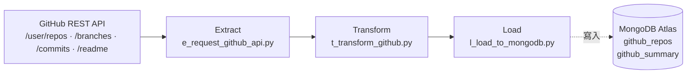

# Task02 — GitHub REST API ETL

> 本文件是 **task02 專用的執行指引**，補足專案根目錄 high-level [`README.md`](../README.md) 未涵蓋的實作細節。
> 環境安裝的「共用前置」（pyenv + Poetry、MongoDB Atlas 帳號、Docker Desktop）請見根目錄 [`README.md`](../README.md)；本文只寫 task02 自己要準備的東西與執行步驟。


# Purpose

- 抓取本人持有（owner）與協作（collaborator）的所有 GitHub repo，取得每個 repo 的中繼資料、本人 commit 與 README。
- 清洗成每個 repo 一筆的文檔，並統計成一份彙整摘要。
- 寫入 MongoDB Atlas 的 `github_repos` 與 `github_summary` 兩個 collection，供 dashboard 首頁呈現最近專案與語言／角色分佈。


# Table of Contents
- [Purpose](#purpose)
- [DataFlow](#dataflow)
- [Project Structures](#project-structures)
- [Configuration](#configuration)
- [Schema of Collections (Tables) in Database of MongoDB Atlas](#schema-of-collections-tables-in-database-of-mongodb-atlas)
- [Data Source](#data-source)
- [Get Started](#get-started)
  - [(Option 1) Run on-premise without Docker Container](#option-1-run-on-premise-without-docker-container)
  - [(Option 2) Run on-premise with Docker Container](#option-2-run-on-premise-with-docker-container)
  - [(Option 3) Run by Cloud Run Job](#option-3-run-by-cloud-run-job)

---

# DataFlow



- **Extract**：所有跟 GitHub API 溝通的邏輯都在這裡，主要含分頁、rate limit 處理與各 endpoint 的抓取函式。
    - `GET /user/repos?type=all` 一次涵蓋 owner + collaborator；逐 repo 抓 branch names；逐 repo 與 branch 呼叫 `/commits` 與 `/readme`；分頁每頁 100 筆。
    - Rate Limit 控制：每次 response 後讀取 header 檢視`retry-after`、`x-ratelimit-remaining` 與 `x-ratelimit-reset`。暫停請求與否依序按照 `retry-after`、`x-ratelimit-remaining`、`x-ratelimit-reset` 是否達到門檻值，一有達到便進行 time.sleep() 避免頻繁觸動 429 Error。
- **Transform**：把 API 回來的原始 dict 清洗並統計出 repository 摘要。統計項目眾多，大致羅列如下：
    - 以 `owner.login == GITHUB_USERNAME` 判斷 role（owner / collaborator）。
    - 以 `committer.email == GITHUB_MAIL` 過濾出本人的 commit
    - 判別 repository 特徵 (e.g. programming language)。
    - 解析 README 與 URL。
- **Load**： upsert 寫入 MongoDB Atlas，支援冪等重跑。
    - Collection `github_repos` 以 `repo_id` 為唯一鍵。upsert
    - Collection `github_summary` 以 `snapshot_date` 為唯一鍵，快照日當天僅留存最後一筆。

---

# Project Structures

```plaintext
task02_github_restapi_etl/
├── main.py                   # 入口：run_task02()
├── e_request_github_api.py   # Extract：GitHub REST API 抓取 & rate limit 控制與分頁
├── t_transform_github.py     # Transform：組 repo 紀錄 & 彙整摘要
├── l_load_to_mongodb.py      # Load：upsert MongoDB Atlas
├── README.md                 # 本文件
└── __init__.py
```

# Configuration

- 執行 task02 需要以下環境變數。
- **地端執行**：把 key/value 寫進專案根目錄 `.env`（複製 `.env.example` 後填入並另存 `.env` 存在地端）。
- **雲端運行**：改存 GCP Secret Manager，容器啟動時注入為環境變數（見 [(Option 3)](#option-3-run-by-cloud-run-job)）。

| 變數名稱          | 說明                                                        | 預設值             | 必填 |
| ----------------- | ----------------------------------------------------------- | ----------------- | --- |
| `GITHUB_TOKEN`    | GitHub personal access token（classic PAT） | 無，需自申請         | ✅  |
| `GITHUB_USERNAME` | GitHub 帳號名稱 | 無，需自訂         | ✅  |
| `GITHUB_MAIL`     | 本人 commit email  | 無，需自訂         | ✅  |
| `MONGO_ALTAS_URI` | MongoDB Atlas 連線字串                                       | 無，需自訂         | ✅  |
| `MONGO_DB_NAME`   | 目標 database 名稱                                           | skill_dashboard | ✅  |

> **如何取得 `GITHUB_TOKEN`**：GitHub → Settings → Developer settings → Personal access tokens (classic) → 產生一組具 **repo scope** 的 token，填入 `.env` 或 Secret Manager。

---

# Schema of Collections (Tables) in Database of MongoDB Atlas

## Collection 1 — `github_repos`

- 每筆 = 一個 repo（本人持有或協作）的中繼資料與本人 commit 摘要。
- Upsert key：`repo_id`。

| **欄位名稱**      | **欄位語意**                          | **資料型別**                       | **值來源**                                        |
| :---------------- | :------------------------------------ | :--------------------------------- | :------------------------------------------------ |
| `_id`             | MongoDB 自動生成的唯一識別碼 (Primary key) | ObjectId                           | MongoDB 自動產生                                  |
| `repo_id`         | repo 識別碼（Upsert key）              | Integer                            | GitHub API `/user/repos` 之 `id`                  |
| `repo_name`       | repo 名稱                             | String                             | GitHub API `name`                                 |
| `repo_full_name`  | repo 完整名稱（owner/repo）           | String                             | GitHub API `full_name`                            |
| `description`     | repo 描述                            | String \| null                     | GitHub API `description`                           |
| `language`        | 主要程式語言（空值填 `others`）       | String                             | GitHub API `language`                             |
| `is_private`      | 是否為私有 repo                       | Bool                               | GitHub API `private`                              |
| `role`            | 本人在此 repo 的角色                  | String (`owner` / `collaborator`)  | Transform：以 `owner.login == username` 判斷      |
| `created_at`      | repo 建立時間                        | Date (ISO 8601)                    | GitHub API `created_at`                           |
| `pushed_at`       | repo 最後 push 時間                   | Date (ISO 8601)                    | GitHub API `pushed_at`                            |
| `commit_counts`   | 本人 commit 數量                      | Integer                            | Transform：過濾 committer email 為本人後計數      |
| `commits`         | 本人 commit 清單                      | Array (Object)                     | GitHub API `/commits`                             |
| `readme_summary`  | README 摘要（前 300 字）              | String                             | GitHub API `/readme` base64 解碼後取前 300 字     |
| `readme_url`      | README 的 GitHub 連結                 | String                             | GitHub API `/readme` 回傳的 `html_url`            |
| `topics`          | repo 主題標籤                        | Array (String)                     | GitHub API `topics`                               |
| `stars`           | star 數量                            | Integer                            | GitHub API `stargazers_count`                     |
| `fetched_at`      | 本筆資料抓取時間                      | Date (ISO 8601)                    | task02 Extract 階段自訂函式                       |

- example of a row in JSON

```json
{
  "_id" : ObjectId("6a5ddeb7..."),
  "repo_id": 123456789,
  "repo_name": "etl-pipeline",
  "repo_full_name": "yourname/etl-pipeline",
  "description": "This project is an ETL pipeline...",
  "language": "Python",
  "is_private": false,
  "role": "owner",
  "created_at": ISODate("2026-02-04T06:06:12.000+0000"),
  "pushed_at": ISODate("2026-06-07T07:15:17.000+0000"),
  "commit_counts": 42,
  "commits": [
    { "sha": "abc123", "message": "init: scaffold ETL structure", "committed_at": ISODate("2026-03-15T03:06:59.000+0000") }
  ],
  "readme_summary": "This project is an ETL pipeline...",
  "readme_url": "https://github.com/yourname/etl-pipeline/blob/main/README.md",
  "topics": ["etl", "python", "mongodb"],
  "stars": 0,
  "fetched_at": ISODate("2026-07-25T01:29:57.204+0000")
}
```

## Collection 2 — `github_summary`

- 每日快照，以 `snapshot_date` 為唯一鍵每日覆蓋。
- Upsert key：`snapshot_date`。

| **欄位名稱**          | **欄位語意**             | **資料型別**                  | **值來源**                             |
| :-------------------- | :----------------------- | :---------------------------- | :------------------------------------- |
| `_id`                 | MongoDB 自動生成的唯一識別碼 (Primary key) | ObjectId                      | MongoDB 自動產生                       |
| `snapshot_date`       | 快照日（Upsert key）      | Date (ISO 8601) (時間部分均歸零)  | task02 Load 階段自訂函式               |
| `total_repos`         | 總 repo 數量             | Integer                       | collection `github_repos`              |
| `by_role`             | 各角色 repo 數量         | Object (Embedded Integer)     | collection `github_repos`              |
| `by_language`         | 各程式語言 repo 數量     | Object (Embedded Integer)     | collection `github_repos`              |
| `total_commits`       | 本人總 commit 數量       | Integer                       | collection `github_repos`              |
| `recent_three_repos`  | 最近更新的 3 個 repo 列表 | Array (Object)                | collection `github_repos`              |

- example of a row in JSON

```json
{
  "_id" : ObjectId("6a5ddeb7..."),
  "snapshot_date": ISODate("2026-07-25T00:00:00.000+0000"),
  "total_repos": 15,
  "by_role": { "owner": 12, "collaborator": 3 },
  "by_language": { "Python": 8, "SQL": 2, "Shell": 1, "others": 4 },
  "total_commits": 287,
  "recent_three_repos": [
    { "repo_name": "etl-pipeline", "pushed_at": ISODate("2025-04-23T10:00:00.000+0000"), "language": "Python", "description": "This project is an ETL pipeline..." },
    { "repo_name": "quick-notes", "pushed_at": ISODate("2025-04-20T08:00:00.000+0000"), "language": "Shell", "description": null }
  ]
}
```
> Collection 1 & 2 的實體關係圖 (Entity-Relationship Diagram) 可見 [Lucid chart](https://lucid.app/lucidchart/63122cc4-527c-4823-b570-ec85cf7452c3/edit?viewport_loc=-31618%2C-6610%2C5638%2C3022%2C0_0&invitationId=inv_318a6fdc-8972-40a9-a3ee-1de9ae651949)。

---

# Data Source

task02 的資料來源為 **GitHub REST API**（`https://api.github.com`），無需事先準備任何 dataset 或 GCS bucket，只要具備一組有 repo 讀取權限的 PAT 即可。

| 類型               | 說明                              |
| ------------------ | --------------------------------- |
| Owner repos        | 本人持有（public + private）      |
| Collaborator repos | 身為協作者的 public repos         |

實際呼叫的 endpoint：

| Endpoint                             | 用途                    | 備註                                              |
| ------------------------------------ | --------------------- | ----------------------------------------------- |
| `GET /user/repos`                    | 抓取所有 repo 清單       | `type=all`，涵蓋 owner / collaborator / org member |
| `GET /repos/{owner}/{repo}/branches` | 抓取單一 repo 的 branch 名稱 | -                                            |
| `GET /repos/{owner}/{repo}/commits`  | 逐 branch 抓 commits    | 空 repo 回 409 → 跳過回空清單                     |
| `GET /repos/{owner}/{repo}/readme`   | 抓 README（前 300 字元） | 找不到（404）回空字串                             |

---

# Get Started

1. 準備一個 NoSQL 資料庫（MongoDB Atlas）。建立叢集、database user、Network Access 的步驟見根目錄 [`README.md`](../README.md)。
2. 依 [Configuration](#configuration) 設定環境變數。
3. 取得具 `repo` scope 的 GitHub PAT（見 [Data Source](#data-source)）。
4. 以下三種方式擇一執行 task02。

## (Option 1) Run on-premise without Docker Container

在專案根目錄執行：

```bash
poetry run python -m task02_github_restapi_etl.main
```

## (Option 2) Run on-premise with Docker Container

1. 確認 Docker Desktop 已安裝且 daemon 執行中。
2. 從根目錄 export requirements 並 build image（Dockerfile 位於 `docker/Dockerfile.task02`）：

```bash
cd 06_personnel_skill_library

docker build \
    -f docker/Dockerfile.task02 \
    -t task02-github-restapi-etl:latest .
```

3. 啟動 container（掛入 `.env` 注入環境變數，task 會自動執行）：

```bash
docker run --rm --env-file ./.env \
    --name task02-github-restapi-etl \
    task02-github-restapi-etl:latest
```

## (Option 3) Run by Cloud Run Job

1. **Service Account**：使用 `psd-no-gcs-task`，授予 `Secret Manager Secret Accessor`、`Cloud Run Developer`。
2. **Secret Manager**：把 [Configuration](#configuration) 的 5 個變數（`GITHUB_TOKEN`、`GITHUB_USERNAME`、`GITHUB_MAIL`、`MONGO_ALTAS_URI`、`MONGO_DB_NAME`）存為 secrets。
3. **Build image**（同 Option 2）：

```bash
docker build --platform=linux/amd64 \
    -f docker/Dockerfile.task02 \
    -t task02-github-restapi-etl:latest .
```

> 建議加上 `--platform=linux/amd64`：Cloud Run 執行環境通常是 linux/amd64，若您在 Apple Silicon（arm64）等非 amd64 機器 build image，不指定平台會導致 Cloud Run 無法啟動 container。

4. **Push 到 Artifact Registry**：

```bash
docker push <location>-docker.pkg.dev/<GCP_PROJECT_ID>/<AR_repo_name>/task02-github-restapi-etl:latest
# 例：
# docker push asia-east1-docker.pkg.dev/causal-inquiry-484423-e7/personal-skill-dashboard/task02-github-restapi-etl:latest
```

5. **建立 Cloud Run Job**：指定上述 image、掛載 Secret Manager secrets 為環境變數、`Security` 分頁的 `Identity to be used by the job` 填 `psd-no-gcs-task`。部署流程參考 [官方指引](https://docs.cloud.google.com/run/docs/quickstarts/jobs/create-execute?hl=zh-tw)。
6. 手動觸發一次確認 Atlas 有資料寫入，之後以 **Cloud Scheduler** 定期觸發。

> 建議額外創一支單純的 service account `cloud-scheduler-trigger`，僅給予 `Cloud Run Developer` 角色。

> **若您 fork 本專案分支**：repo 內已備好 GitHub Actions workflow（`.github/workflows/deploy_task02_github_restapi_etl.yml`），當 push 到 `develop` 且 `task02_github_restapi_etl/**` 或 `docker/Dockerfile.task02` 有變動時，會自動 build image、push 到 Artifact Registry 並 deploy 到 Cloud Run Job。要啟用它，需自行在 GCP 申請 Workload Identity Federation（讓 GitHub Actions 免存 SA JSON key 即可認證 GCP）。若您不打算 fork，忽略本註即可——上述 1–6 步手動流程已足夠。
