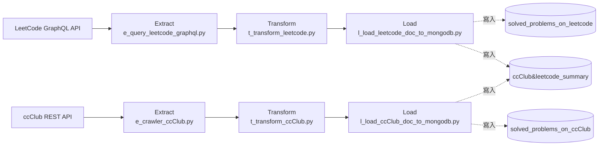

# Task03 — LeetCode GraphQL + ccClub REST API ETL

> 本文件是 **task03 專用的執行指引**，補足專案根目錄 high-level [`README.md`](../README.md) 未涵蓋的實作細節。
> 環境安裝的「共用前置」（pyenv + Poetry、MongoDB Atlas 帳號、Docker Desktop）請見根目錄 [`README.md`](../README.md)；本文只寫 task03 自己要準備的東西與執行步驟。


# Purpose

- 抓取本人在 **[LeetCode](https://leetcode.com/)** 與 **[ccClub Judge](https://www.ccclub.io/login)** 兩個平台上所有已解（AC）的題目，取得每題的難度與主題標籤。
- 清洗成每題一筆的文檔，並各自統計成刷題摘要（難度分佈、主題佔比）。
- 寫入 MongoDB Atlas 的 `solved_problems_on_leetcode`、`solved_problems_on_ccClub` 與共用的 `ccClub&leetcode_summary`，供 dashboard 首頁呈現刷題三相 donut chart。


# Table of Contents
- [Purpose](#purpose)
- [DataFlow](#dataflow)
- [Project Structures](#project-structures)
- [Configuration](#configuration)
- [Schema of Collections (Tables) in Database of MongoDB Atlas](#schema-of-collections-tables-in-database-of-mongodb-atlas)
- [Data Source](#data-source)
- [Get Started](#get-started)
  - [(Option 1) Run on-premise without Docker Container](#option-1-run-on-premise-without-docker-container)
  - [(Option 2) Run on-premise with Docker Container](#option-2-run-on-premise-with-docker-container)
  - [(Option 3) Run by Cloud Run Job](#option-3-run-by-cloud-run-job)


# DataFlow

task03 是兩條各自獨立的 pipeline（LeetCode 與 ccClub），最後把摘要寫進**同一個** `ccClub&leetcode_summary`（各自 partial update、欄位互不覆蓋）。



- **Extract**：所有跟 LeetCode / ccClub 溝通的邏輯都在這裡，含認證、分頁與逐題補資料。
    - LeetCode：以兩支 GraphQL query 抓「已解題清單」與「各難度已解題數」；已解題清單以單次請求抓取（`skip=0, limit=100`，未分頁、上限 100 題）；cookie 過期防呆。
    - ccClub：以 `requests.Session` 帳密登入並取得 rotate 後的 csrftoken；逐題呼叫 `GET /api/problem?problem_id={id}` 補齊 topic 與 difficulty，每題間隔 0.3 秒 throttle 保護 server。
- **Transform**：把 API 回來的原始資料清洗成乾淨的題目文檔，並統計出摘要。
    - LeetCode：攤平 GraphQL 巢狀欄位與統計各 difficulty 題數。
    - ccClub：difficulty 欄位值標準化。
- **Load**： upsert 寫入 MongoDB。


# Project Structures

```plaintext
task03_leetcode_ccClub_etl/
├── main.py                          # 入口：依序跑 LeetCode 與 ccClub 兩條 pipeline
├── e_query_leetcode_graphql.py      # Extract：LeetCode GraphQL 抓題目與難度統計
├── e_crawler_ccClub.py              # Extract：ccClub 登入與逐題補資料
├── t_transform_leetcode.py          # Transform：組 LeetCode 題目紀錄 & 摘要
├── t_transform_ccClub.py            # Transform：組 ccClub 題目紀錄 & 摘要
├── l_load_leetcode_doc_to_mongodb.py# Load：upsert MongoDB Atlas（LeetCode）
├── l_load_ccClub_doc_to_mongodb.py  # Load：upsert MongoDB Atlas（ccClub）
├── README.md                        # 本文件
└── __init__.py
```


# Configuration

- 執行 task03 需要以下環境變數。
- **地端開發**：把 key/value 寫進專案根目錄 `.env`（複製 `.env.example` 後填入另存為 `.env`）。
- **雲端部署**：改存 GCP Secret Manager，容器啟動時注入為環境變數（見 [(Option 3)](#option-3-run-by-cloud-run-job)）。

| 變數名稱            | 說明                                            | 預設值             | 必填 |
| ------------------- | ----------------------------------------------- | ----------------- | --- |
| `LEETCODE_USERNAME` | LeetCode 帳號名稱                                | 無，需自訂         | ✅  |
| `LEETCODE_SESSION`  | LeetCode session cookie（有時效性，約數週）        | 無，需自訂         | ✅  |
| `CSRF_TOKEN`        | LeetCode csrftoken cookie（有時效性，約數週）      | 無，需自訂         | ✅  |
| `CCCLUB_USERNAME`   | ccClub Judge 帳號名稱                            | 無，需自訂         | ✅  |
| `CCCLUB_PASSWORD`   | ccClub Judge 密碼                               | 無，需自訂         | ✅  |
| `MONGO_ALTAS_URI`   | MongoDB Atlas 連線字串                           | 無，需自訂         | ✅  |
| `MONGO_DB_NAME`     | 目標 database 名稱                               | `skill_dashboard` | ✅  |

> **如何取得 `LEETCODE_SESSION` 與 `CSRF_TOKEN`**：登入 LeetCode → 開瀏覽器 DevTools → Application/Storage → Cookies → `https://leetcode.com` → 複製 `LEETCODE_SESSION` 與 `csrftoken` 兩個 cookie 值。`LEETCODE_SESSION` 約 2~3 週後自動失效，或是帳號登出過會同時導致`LEETCODE_SESSION` 與 `csrftoken` 失效，失效將導致 Job 失敗，此時需重新取得並更新。


# Schema of Collections (Tables) in Database of MongoDB Atlas

## Collection 1 — `solved_problems_on_leetcode`

- 每筆 = 一道 LeetCode AC 題目。
- Upsert key：`frontendQuestionId`。

| **欄位名稱**          | **欄位語意**          | **資料型別**    | **值來源**                                                            |
| :-------------------- | :-------------------- | :-------------- | :------------------------------------------------------------------- |
| `_id`                 | MongoDB 自動生成的唯一識別碼 (Primary key) | ObjectId | MongoDB 自動產生                                              |
| `frontendQuestionId`  | LeetCode 前台題號（Upsert key） | String  | LeetCode GraphQL `problemsetQuestionList.questions.frontendQuestionId` |
| `title`               | 題目標題              | String          | LeetCode GraphQL `...questions.title`                                 |
| `topic`               | 題目主題標籤          | Array (String)  | LeetCode GraphQL `...questions.topicTags` 之 `name`                   |
| `difficulty`          | 題目難度              | String          | LeetCode GraphQL `...questions.difficulty`                           |

- example of a row in JSON

```json
{
  "_id" : ObjectId("6a0534b...."),
  "frontendQuestionId": "1",
  "title": "Two Sum",
  "topic": ["array", "hash-table"],
  "difficulty": "Easy"
}
```

## Collection 2 — `solved_problems_on_ccClub`

- 每筆 = 一道 ccClub 已解題目。
- Upsert key：`problem_id`。

| **欄位名稱**    | **欄位語意**          | **資料型別**    | **值來源**                                                                |
| :-------------- | :-------------------- | :-------------- | :------------------------------------------------------------------------ |
| `_id`           | MongoDB 自動生成的唯一識別碼 (Primary key) | ObjectId  | MongoDB 自動產生                                              |
| `problem_id`    | ccClub 題目 ID（Upsert key） | String    | ccClub REST API                                                           |
| `problem_type`  | 題目類型              | String          | ccClub REST API                                                           |
| `score`         | 得分                  | Integer         | ccClub REST API                                                           |
| `topic`         | 題目主題標籤          | Array (String)  | ccClub `GET /api/problem`                                                 |
| `difficulty`    | 題目難度（標準化後）   | String          | ccClub `GET /api/problem`；標準化：Low/Easy→Easy、Mid→Med.、High→Hard      |

- example of a row in JSON

```json
{
  "_id" : ObjectId("6a0535...."),
  "problem_id": "180001",
  "problem_type": "ACM",
  "score": 0,
  "topic": ["String"],
  "difficulty": "Easy"
}
```

## Collection 3 — `ccClub&leetcode_summary`

- 每日快照，LeetCode 與 ccClub 兩側各自以 `$set` partial update 寫入，以 `snapshot_date` 為唯一鍵、欄位互不覆蓋。
- Upsert key：`snapshot_date`。

| **欄位名稱**                     | **欄位語意**              | **資料型別**                        | **值來源**                                             |
| :------------------------------- | :----------------------- | :---------------------------------- | :----------------------------------------------------- |
| `_id`                            | MongoDB 自動生成的唯一識別碼 (Primary key) | ObjectId             | MongoDB 自動產生                                       |
| `snapshot_date`                  | 快照日（Upsert key）      | Date (ISO 8601) (時間部分均歸零)   | task03 Load 階段自訂函式                               |
| `totalSolvedProblemsOnCCclub`    | ccClub 已解題總數        | Integer                             | collection `solved_problems_on_ccClub`                 |
| `totalSolvedProblemsOnLeetcode`  | LeetCode 已解題總數      | Integer                             | collection `solved_problems_on_leetcode`               |
| `problemDifficultyOnLeetcode`    | LeetCode 各難度已解題數 | Array (Object)              | LeetCode GraphQL `submitStatsGlobal.acSubmissionNum`   |
| `problemDifficultyOnCCclub`      | ccClub 各難度百分比      | Array (Object)                      | 從 collection `solved_problems_on_ccClub` 計算         |
| `topicsPercentOnCCclub`          | ccClub 各主題百分比      | Object (Embedded Float)             | 從 collection `solved_problems_on_ccClub` 計算         |
| `topicsPercentOnLeetcode`        | LeetCode 各主題百分比    | Object (Embedded Float)             | 從 collection `solved_problems_on_leetcode` 計算       |

- example of a row in JSON

```json
{
  "_id" : ObjectId("6a5ddeb7..."),
  "snapshot_date": ISODate("2026-07-25T00:00:00.000+0000"),
  "totalSolvedProblemsOnCCclub": 264,
  "totalSolvedProblemsOnLeetcode": 15,
  "problemDifficultyOnLeetcode": [
    { "difficulty": "All", "count": 15 },
    { "difficulty": "Easy", "count": 11 },
    { "difficulty": "Medium", "count": 3 },
    { "difficulty": "Hard", "count": 1 }
  ],
  "problemDifficultyOnCCclub": [
    { "difficulty": "Easy", "percentage": 75.0 },
    { "difficulty": "Med.", "percentage": 20.0 },
    { "difficulty": "Hard", "percentage": 5.0 }
  ],
  "topicsPercentOnCCclub": { "String": 20.0, "Math": 80.0 },
  "topicsPercentOnLeetcode": { "array": 13.4, "hash-table": 12.6, "dynamic-programming": 74.0 }
}
```
> Collection 1 & 2  & 3 的實體關係圖 (Entity-Relationship Diagram) 可見 [Lucid chart](https://lucid.app/lucidchart/63122cc4-527c-4823-b570-ec85cf7452c3/edit?viewport_loc=-31618%2C-6610%2C5638%2C3022%2C0_0&invitationId=inv_318a6fdc-8972-40a9-a3ee-1de9ae651949)。


# Data Source

task03 的資料來源為兩個線上刷題平台的 API，無需事先準備任何 dataset：

| 來源          | 協定                                        | 認證方式                                            |
| ------------- | ------------------------------------------- | --------------------------------------------------- |
| LeetCode      | GraphQL（`https://leetcode.com/graphql/`）   | 瀏覽器 Cookie（`LEETCODE_SESSION` + `csrftoken`）    |
| ccClub Judge  | REST API（`https://judge.ccclub.io/api`）    | 帳號密碼登入，session 自動維持 cookie                |

實際使用的 query / endpoint：

| Query / Endpoint                              | 用途                          | 備註                                          |
| --------------------------------------------- | ----------------------------- | --------------------------------------------- |
| GraphQL `problemsetQuestionList`              | 抓已解題清單                   | 單次請求，`limit=100`、未分頁（上限 100 題） |
| GraphQL `userProblemsSolved` → `submitStatsGlobal.acSubmissionNum` | 抓各難度已解題數（含 All） |  -                          |
| `POST /api/login`                             | ccClub 帳密登入取得 session    | 登入後重新取得 rotate 的 csrftoken            |
| `GET /api/problem?problem_id={id}`            | 逐題補齊 topic 與 difficulty   | 每題間隔 0.3 秒 throttle                       |


# Get Started

1. 準備一個 NoSQL 資料庫（MongoDB Atlas）。建立叢集、database user、Network Access 的步驟見根目錄 [`README.md`](../README.md)。
2. 依 [Configuration](#configuration) 設定環境變數（特別是 LeetCode 的兩個 cookie，需先從瀏覽器取得）。
3. 以下三種方式擇一執行 task03。`main.py` 會先跑 LeetCode 再跑 ccClub 兩條 pipeline。

## (Option 1) Run on-premise without Docker Container

在專案根目錄執行：

```bash
poetry run python -m task03_leetcode_ccClub_etl.main
```

## (Option 2) Run on-premise with Docker Container

1. 確認 Docker Desktop 已安裝且 daemon 執行中。
2. 從根目錄 build image（Dockerfile 位於 `docker/Dockerfile.task03`；地端 build 不需要 `--platform`）：

```bash
cd 06_personnel_skill_library

docker build \
    -f docker/Dockerfile.task03 \
    -t task03-leetcode-ccclub-etl:latest .
```

3. 啟動 container（掛入 `.env` 注入環境變數，task 會自動執行）：

```bash
docker run --rm --env-file ./.env \
    --name task03-leetcode-ccclub-etl \
    task03-leetcode-ccclub-etl:latest
```

## (Option 3) Run by Cloud Run Job

1. **Service Account**：帳號名稱參考命名 `psd-no-gcs-task`，授予 `Secret Manager Secret Accessor`、`Cloud Run Developer`。
2. **Secret Manager**：把 [Configuration](#configuration) 的 7 個變數（`LEETCODE_USERNAME`、`LEETCODE_SESSION`、`CSRF_TOKEN`、`CCCLUB_USERNAME`、`CCCLUB_PASSWORD`、`MONGO_ALTAS_URI`、`MONGO_DB_NAME`）存為 secrets。
3. **Build image**：

```bash
docker build --platform=linux/amd64 \
    -f docker/Dockerfile.task03 \
    -t task03-leetcode-ccclub-etl:latest .
```

> 建議加上 `--platform=linux/amd64`：Cloud Run 執行環境通常是 linux/amd64，若您在非 amd64 機器（如 Apple Silicon arm64）build image，不指定平台會導致 Cloud Run 無法啟動 container。

4. **Push 到 Artifact Registry**：

```bash
docker push <location>-docker.pkg.dev/<GCP_PROJECT_ID>/<AR_repo_name>/task03-leetcode-ccclub-etl:latest
# 例：
# docker push asia-east1-docker.pkg.dev/causal-inquiry-484423-e7/personal-skill-dashboard/task03-leetcode-ccclub-etl:latest
```

5. **建立 Cloud Run Job**：指定上述 image、掛載 Secret Manager secrets 為環境變數、`Security` 分頁的 `Identity to be used by the job` 填步驟 1 命名的帳號名稱 `psd-no-gcs-task`。部署流程參考 [官方指引](https://docs.cloud.google.com/run/docs/quickstarts/jobs/create-execute?hl=zh-tw)。
6. 手動觸發一次確認 Atlas 有資料寫入，之後以 **Cloud Scheduler** 定期觸發。
> 建議額外創一支單純的 service account `cloud-scheduler-trigger`，僅給予 `Cloud Run Developer` 角色。

> **cookie 時效提醒**：`LEETCODE_SESSION` 約 2~3 週後自動失效，或是帳號登出過會同時導致`LEETCODE_SESSION` 與 `csrftoken` 失效。Job 失敗時多半是這兩個 cookie 過期，需手動到瀏覽器重新取得 cookie 並更新 Secret Manager，再重跑 Job。

> **若您 fork 本專案分支**：repo 內已備好 GitHub Actions workflow（`.github/workflows/deploy_task03_leetcode_ccClub_etl.yml`），當 push 到 `develop` 且 `task03_leetcode_ccClub_etl/**` 或 `docker/Dockerfile.task03` 有變動時，會自動 build image、push 到 Artifact Registry 並 deploy 到 Cloud Run Job。要啟用它，需自行在 GCP 申請 Workload Identity Federation（讓 GitHub Actions 免存 SA JSON key 即可認證 GCP）。若您不打算 fork，忽略本註即可——上述 1–6 步手動流程已足夠。
