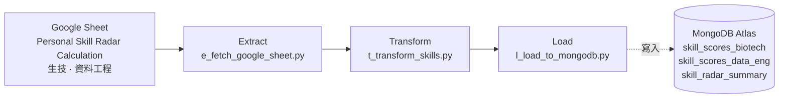

# Task05 — Google Sheet Skill Radar ETL

> 本文件是 **task05 專用的執行指引**，補足專案根目錄 high-level [`README.md`](../README.md) 未涵蓋的實作細節。
> 環境安裝的「共用前置」（pyenv + Poetry、MongoDB Atlas 帳號、Docker Desktop）請見根目錄 [`README.md`](../README.md)；本文只寫 task05 自己要準備的東西與執行步驟。


# Purpose

- 讀取 Google Sheet 中「生技」與「資料工程」兩張技能盤點工作表，取得每個任務在複雜性／獨立性／影響力三面向的能力勾選。
- 依權重把每個任務算成分數，並彙整成每個雷達軸的層級（level）。
- 寫入 MongoDB Atlas 的 `skill_scores_biotech`、`skill_scores_data_eng` 與 `skill_radar_summary`，供 dashboard 首頁繪製技能雷達圖。
> 以下的說明中，會使用 `Personal Skill Radar Calculation` 代稱一個 Google Sheet 的實際案例，可於[章節 data-source](#data-source) 下載到模板。

# Table of Contents
- [Purpose](#purpose)
- [DataFlow](#dataflow)
- [Project Structures](#project-structures)
- [Configuration](#configuration)
- [Schema of Collections (Tables) in Database of MongoDB Atlas](#schema-of-collections-tables-in-database-of-mongodb-atlas)
- [Data Source](#data-source)
- [Get Started](#get-started)
  - [(Option 1) Run on-premise without Docker Container](#option-1-run-on-premise-without-docker-container)
  - [(Option 2) Run on-premise with Docker Container](#option-2-run-on-premise-with-docker-container)
  - [(Option 3) Run by Cloud Run Job](#option-3-run-by-cloud-run-job)


# DataFlow



- **Extract**：透過 service account 授權開啟 Google Sheet，把兩張工作表讀成 DataFrame。
    - 以 `pygsheets` 處理授權，取得讀取 Google Sheet `Personal Skill Radar Calculation`的權限，分別讀出 `生技` 與 `資料工程` 兩張 worksheet 並轉為 pandas DataFrame。
- **Transform**：把能力勾選算成分數，再彙整成雷達軸摘要。
    - 標記為 `Y` 的能力旗標轉為 `1`、其餘轉 `0`；每個任務依「複雜性 / 獨立性 / 影響力」三面向各自加權計分。
    - 生技與資料工程的複雜性欄位名稱不同，故拆成兩套各自的轉換邏輯；再算出單項任務總分、映射出雷達軸層級（level，作為雷達圖軸刻度）。共產出三個 DataFrame。
- **Load**： upsert 寫入 MongoDB。
    - Collection `skill_scores_biotech`、`skill_scores_data_eng`: 以 `雷達軸 + 經手任務` 為複合唯一鍵。
    - Collection `skill_radar_summary`: 以 `snapshot_date + 雷達軸 + 雷達圖名稱` 為複合唯一鍵，快照日當天僅留最後一筆快照。


# Project Structures

```plaintext
task05_googlesheet_skill_etl/
├── main.py                   # 入口：run_task05()
├── e_fetch_google_sheet.py   # Extract：授權並讀取兩張 worksheet
├── t_transform_skills.py     # Transform：能力旗標計分與雷達軸層級映射
├── l_load_to_mongodb.py      # Load：upsert MongoDB Atlas
├── README.md                 # 本文件
└── __init__.py
```


# Configuration

- 執行 task05 需要以下環境變數。
- **地端開發**：把 key/value 寫進專案根目錄 `.env`（複製 `.env.example` 後填入）。
- **雲端部署**：改存 GCP Secret Manager，容器啟動時注入為環境變數（見 [(Option 3)](#option-3-run-by-cloud-run-job)）。

| 變數名稱            | 說明                                                             | 預設值             | 必填 |
| ------------------- | ---------------------------------------------------------------- | ----------------- | --- |
| `GOOGLE_SHEET_KEY`  | Google Sheet service account 憑證。**地端**填 JSON key 檔的路徑；**雲端**填 JSON 字串 | 無，需自訂         | ✅  |
| `MONGO_ALTAS_URI`   | MongoDB Atlas 連線字串                                            | 無，需自訂         | ✅  |
| `MONGO_DB_NAME`     | 目標 database 名稱                                                | skill_dashboard | ✅  |

> **如何取得 GOOGLE_SHEET_KEY（service account JSON key）**：GCP Console → IAM & Admin → Service Accounts → 建立一個 service account → Keys → Add Key → JSON，下載後存到專案內（例如 `./env/googlesheet-user.json`）。

> **授權此 SA 讀取 Google Sheet **：在 `Personal Skill Radar Calculation` Google Sheet 右上角「共用」，把上一步 SA 的 email（`xxx@<project>.iam.gserviceaccount.com`）加為**檢視者（Viewer）**。

---

# Schema of Collections (Tables) in Database of MongoDB Atlas

## Collection 1 — `skill_scores_biotech`

- 每筆 = 生技 worksheet 中一個任務，附加計算後的分數欄位。
- Upsert key：`雷達軸 + 經手任務`（複合唯一鍵）。

| **欄位名稱**                               | **欄位語意**              | **資料型別**             | **值來源**                          |
| :----------------------------------------- | :----------------------- | :----------------------- | :---------------------------------- |
| `雷達軸`                                   | 所屬雷達軸（複合鍵之一）   | String                   | Google Sheet `生技` worksheet       |
| `經手任務`                                 | 任務名稱（複合鍵之一）     | String                   | Google Sheet `生技` worksheet       |
| `複雜性 - 純紀錄`                          | 複雜性能力旗標            | Number (Integer 0/1)     | Google Sheet（經 Transform: 轉換為 0 或 1）         |
| `複雜性 - 執行操作`                        | 複雜性能力旗標            | Number (Integer 0/1)     | Google Sheet（經 Transform: 轉換為 0 或 1）         |
| `複雜性 - 制定方向`                        | 複雜性能力旗標            | Number (Integer 0/1)     | Google Sheet（經 Transform: 轉換為 0 或 1）         |
| `複雜性 - 優化與故障排除`                  | 複雜性能力旗標            | Number (Integer 0/1)     | Google Sheet（經 Transform: 轉換為 0 或 1）         |
| `獨立性 - 需要指導後才能照規章做`          | 獨立性能力旗標            | Number (Integer 0/1)     | Google Sheet（經 Transform: 轉換為 0 或 1）         |
| `獨立性 - 不需指導即可理解並遵照組織規章做` | 獨立性能力旗標            | Number (Integer 0/1)     | Google Sheet（經 Transform: 轉換為 0 或 1）         |
| `獨立性 - 自訂架構`                        | 獨立性能力旗標            | Number (Integer 0/1)     | Google Sheet（經 Transform: 轉換為 0 或 1）         |
| `影響力 - 具備公司外出教學經驗`            | 影響力能力旗標            | Number (Integer 0/1)     | Google Sheet（經 Transform: 轉換為 0 或 1）         |
| `影響力 - 具備跨部門教學經驗`              | 影響力能力旗標            | Number (Integer 0/1)     | Google Sheet（經 Transform: 轉換為 0 或 1）         |
| `影響力 - 具備部門內教學經驗`              | 影響力能力旗標            | Number (Integer 0/1)     | Google Sheet（經 Transform: 轉換為 0 或 1）         |
| `影響力 -  不具備教學的經驗`               | 影響力能力旗標            | Number (Integer 0/1)     | Google Sheet（經 Transform: 轉換為 0 或 1）         |
| `複雜性總分`                               | 複雜性加權總分            | Integer                  | Transform：旗標 × 複雜性權重加總      |
| `獨立性總分`                               | 獨立性加權總分            | Integer                  | Transform：旗標 × 獨立性權重加總      |
| `影響力總分`                               | 影響力加權總分            | Integer                  | Transform：旗標 × 影響力權重加總      |
| `單項任務總分`                             | 任務總分                 | Integer                  | Transform：複雜性 × 1 + 獨立性 × 1 + 影響力 × 2 |

## Collection 2 — `skill_scores_data_eng`

- 每筆 = 資料工程 worksheet 中一個任務，附加計算後的分數欄位。獨立性／影響力權重沿用生技。
- Upsert key：`雷達軸 + 經手任務`（複合唯一鍵）。

| **欄位名稱**                               | **欄位語意**              | **資料型別**             | **值來源**                          |
| :----------------------------------------- | :----------------------- | :----------------------- | :---------------------------------- |
| `雷達軸`                                   | 所屬雷達軸（複合鍵之一）   | String                   | Google Sheet `資料工程` worksheet   |
| `經手任務`                                 | 任務名稱（複合鍵之一）     | String                   | Google Sheet `資料工程` worksheet   |
| `複雜性 - 純紀錄與理解`                    | 複雜性能力旗標            | Number (Integer 0/1)     | Google Sheet（經 Transform: 轉換為 0 或 1）         |
| `複雜性 - 開發測試`                        | 複雜性能力旗標            | Number (Integer 0/1)     | Google Sheet（經 Transform: 轉換為 0 或 1）         |
| `複雜性 - 接手部署`                        | 複雜性能力旗標            | Number (Integer 0/1)     | Google Sheet（經 Transform: 轉換為 0 或 1）         |
| `複雜性 - 優化與故障排除`                  | 複雜性能力旗標            | Number (Integer 0/1)     | Google Sheet（經 Transform: 轉換為 0 或 1）         |
| `獨立性 - 需要指導後才能照規章做`          | 獨立性能力旗標            | Number (Integer 0/1)     | Google Sheet（經 Transform: 轉換為 0 或 1）         |
| `獨立性 - 不需指導即可理解並遵照組織規章做` | 獨立性能力旗標            | Number (Integer 0/1)     | Google Sheet（經 Transform: 轉換為 0 或 1）         |
| `獨立性 - 自訂架構`                        | 獨立性能力旗標            | Number (Integer 0/1)     | Google Sheet（經 Transform: 轉換為 0 或 1）         |
| `影響力 - 具備公司外出教學經驗`            | 影響力能力旗標            | Number (Integer 0/1)     | Google Sheet（經 Transform: 轉換為 0 或 1）         |
| `影響力 - 具備跨部門教學經驗`              | 影響力能力旗標            | Number (Integer 0/1)     | Google Sheet（經 Transform: 轉換為 0 或 1）         |
| `影響力 - 具備部門內教學經驗`              | 影響力能力旗標            | Number (Integer 0/1)     | Google Sheet（經 Transform: 轉換為 0 或 1）         |
| `影響力 -  不具備教學的經驗`               | 影響力能力旗標            | Number (Integer 0/1)     | Google Sheet（經 Transform: 轉換為 0 或 1）         |
| `複雜性總分`                               | 複雜性加權總分            | Integer                  | Transform：能力旗標 × 複雜性權重加總      |
| `獨立性總分`                               | 獨立性加權總分            | Integer                  | Transform：能力旗標 × 獨立性權重加總      |
| `影響力總分`                               | 影響力加權總分            | Integer                  | Transform：能力旗標 × 影響力權重加總      |
| `單項任務總分`                             | 任務總分                 | Integer                  | Transform：複雜性 × 1 + 獨立性 × 2 + 影響力 × 1 |

## Collection 3 — `skill_radar_summary`

- 每筆 = 某一天、某張雷達圖、某個雷達軸的彙總結果。
- Upsert key：`snapshot_date + 雷達軸 + 雷達圖名稱`（複合唯一鍵）。

| **欄位名稱**       | **欄位語意**                      | **資料型別**        | **值來源**                                           |
| :----------------- | :-------------------------------- | :------------------ | :--------------------------------------------------- |
| `雷達圖名稱`       | 雷達圖名稱（複合鍵之一）           | String              | Transform                                            |
| `雷達軸`           | 雷達軸（複合鍵之一）               | String              | Transform                                            |
| `經手任務個數`     | 該軸任務數量                       | Integer             | collection `skill_scores_biotech` / `skill_scores_data_eng` |
| `任務經驗值`       | round(log2(經手任務個數), 6)    | Number (Float)      | Transform                                            |
| `各軸向任務最高分` | 該軸單項任務最高分                 | Integer             | collection `skill_scores_biotech` / `skill_scores_data_eng` |
| `單軸總分`         | round(各軸向任務最高分 + 任務經驗值, 2) | Number (Float) | Transform                                            |
| `level`            | 雷達軸層級（1–5，雷達圖軸刻度）     | Integer             | Transform：依單軸總分區間映射                        |
| `snapshot_date`    | 快照日（複合鍵之一）               | Date (YYYY-MM-DD) | task05 Load 階段自訂函式                             |

- example of a row in JSON

```json
{
  "雷達圖名稱": "雷達圖2資料工程",
  "雷達軸": "Orchestration",
  "經手任務個數": 4,
  "任務經驗值": 2.0,
  "各軸向任務最高分": 27,
  "單軸總分": 29.0,
  "level": 5,
  "snapshot_date": "2026-05-09"
}
```

> **`level` 分級規則（for developer）**：`< 5` → 1、`5 ≤ score < 12` → 2、`12 ≤ score < 15` → 3、`15 ≤ score < 23` → 4、`≥ 23` → 5。各能力旗標的完整權重表見 [`doc/branch_etl_pipeline_summary.md`](../doc/branch_etl_pipeline_summary.md) 的「計分規則」。

> Collection 1 & 2  & 3 的實體關係圖 (Entity-Relationship Diagram) 可見 [Lucid chart](https://lucid.app/lucidchart/63122cc4-527c-4823-b570-ec85cf7452c3/edit?viewport_loc=-31618%2C-6610%2C5638%2C3022%2C0_0&invitationId=inv_318a6fdc-8972-40a9-a3ee-1de9ae651949)。


# Data Source

task05 的資料來源為一份 Google Sheet，**您可複製[這份 Personal Skill Radar Calculation Google sheet 模板連結](https://docs.google.com/spreadsheets/d/11XBgnQpN399uBarhFMuIBNXDmtAyFtpKnlfCanG4_Ck/edit?usp=sharing)的內容，作為自己的 template 與 dataset  sample**，並在共用設定 service account 為檢視者（Viewer）。

| Worksheet   | 說明                 | 輸出雷達圖名稱      |
| ----------- | -------------------- | ------------------- |
| 生技      | 生技領域任務與能力盤點 | 雷達圖1生技       |
| 資料工程  | 資料工程任務與能力盤點 | 雷達圖2資料工程   |

雷達軸設計：

| 生技雷達軸                          | 資料工程雷達軸                |
| ----------------------------------- | ----------------------------- |
| 製程技術 (細胞分注、反應器操作) 操作能力 | ELT/ELT pipeline 操作與維護   |
| 流程設計能力                        | 雲端 (GCP) 服務技術           |
| 跨專案數據整合能力                  | Orchestration                 |
| 文件撰寫能力                        | 資料庫資料模型設計            |
| 簡報口說能力                        | 文案設計與歸納                |
|-                                     | 資料視覺化                    |
|-                                     | 資料品質與血緣維護            |


# Get Started

1. 準備一個 NoSQL 資料庫（MongoDB Atlas）。建立叢集、database user、Network Access 的步驟見根目錄 [`README.md`](../README.md)。
2. 依 [Configuration](#configuration) 設定環境變數，並完成 service account 建立與Google Sheet共用授權。
3. 以下三種方式擇一執行 task05。

## (Option 1) Run on-premise without Docker Container

1. 建立 Google Sheets service account、下載 JSON key，存到專案內（例如 `./env/googlesheet-user.json`），並在 `.env` 把 `GOOGLE_SHEET_KEY` 設為此檔路徑。
2. 參考[章節 Data Source](#data-source) 建立並上傳 Google Sheet 到自己的 Google Drive，接著打開 Google Sheet 「共用」設定，把該 SA 的 email 加為檢視者（Viewer）。
3. 在專案根目錄執行：

    ```bash
    poetry run python -m task05_googlesheet_skill_etl.main
    ```

## (Option 2) Run on-premise with Docker Container

1. 完成 Option 1 的步驟 1–2（SA JSON key 與 Google Sheet 共用授權）。
2. 確認 Docker Desktop 已安裝且 daemon 執行中。
3. 從根目錄 build image：

    ```bash
    cd 06_personnel_skill_library

    docker build \
        -f docker/Dockerfile.task05 \
        -t task05-googlesheet-skill-etl:latest .
    ```

4. 啟動 container，注意 `GOOGLE_SHEET_KEY` 指向的 JSON key 檔需一併掛進容器（例如把 `env/` 目錄以 volume 掛入）：

    ```bash
    docker run --rm --env-file ./.env \
        -v "$(pwd)/env:/app/env:ro" \
        --name task05-googlesheet-skill-etl \
        task05-googlesheet-skill-etl:latest
    ```
    > 容器啟動後 task 會自動執行。

## (Option 3) Run by Cloud Run Job

1. **Service Account**：命名為 `psd-no-gcs-task`，授予 `Secret Manager Secret Accessor`、`Cloud Run Developer` 兩個角色。
    > **容易遺漏點:** 請額外到 Google Sheet 設定「共用」，把此 SA email 加為檢視者（Viewer），而不是只在 IAM 設定。
2. **Secret Manager**：把 [Configuration](#configuration) 的 3 個變數（`GOOGLE_SHEET_KEY`、`MONGO_ALTAS_URI`、`MONGO_DB_NAME`）存為 secrets。`GOOGLE_SHEET_KEY` 存 SA JSON key 的**完整 JSON 字串內容**（非路徑！）。
3. **Build image**：

    ```bash
    docker build --platform=linux/amd64 \
        -f docker/Dockerfile.task05 \
        -t task05-googlesheet-skill-etl:latest .
    ```

    > 建議加上 `--platform=linux/amd64`：Cloud Run 執行環境通常是 linux/amd64，若您在非 amd64 機器（如 Apple Silicon arm64）build image，不指定平台會導致 Cloud Run 無法啟動 container。

4. **Push 到 Artifact Registry**：

    ```bash
    docker push <location>-docker.pkg.dev/<GCP_PROJECT_ID>/<AR_repo_name>/task05-googlesheet-skill-etl:latest
    # 例：
    # docker push asia-east1-docker.pkg.dev/causal-inquiry-484423-e7/personal-skill-dashboard/task05-googlesheet-skill-etl:latest
    ```

5. **建立 Cloud Run Job**：指定上述 image、掛載 Secret Manager secrets 為環境變數、`Security` 分頁的 `Identity to be used by the job` 填入 service account 名稱 `psd-no-gcs-task`。部署流程參考 [官方指引](https://docs.cloud.google.com/run/docs/quickstarts/jobs/create-execute?hl=zh-tw)。
6. 手動觸發一次確認 Atlas 有資料寫入，之後以 **Cloud Scheduler** 定期觸發（建議額外創一支單純的 service account `cloud-scheduler-trigger`，僅給予 `Cloud Run Developer` 角色）。

    > **若您 fork 本專案分支**：repository 內已備好 GitHub Actions workflow（`.github/workflows/deploy_task05_googlesheet_skill_etl.yml`），當 push 到 `develop` 且 `task05_googlesheet_skill_etl/**` 或 `docker/Dockerfile.task05` 有變動時，會自動 build image、push 到 Artifact Registry 並 deploy 到 Cloud Run Job。要啟用它，需自行在 GCP 申請 Workload Identity Federation（讓 GitHub Actions 免存 SA JSON key 即可認證 GCP）。若您不打算 fork，忽略本註即可 —— 上述 1–6 步手動流程已足夠。
