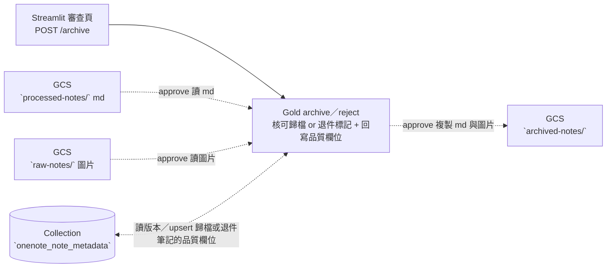

# Task07 v02 — Gold Archive/Reject Service（localhost:8003）

> 本文件是 **task07 Gold 服務專用的執行指引**，補足專案根目錄 high-level [`README.md`](../README.md) 未涵蓋的實作細節。

> task07 v02 是三層獨立服務加上一個共用套件的拆分架構：**[Bronze 下載](../task07_onenote_to_markdown_lazy_loading/README.md)**、[Silver enrich 服務](../task07_silver_service/README.md)、[Gold 歸檔/退件服務(本資料夾)](./README.md)，與共用的 [tools](./task07_common/)。

> 本文只寫 Gold 層服務。


# Purpose

- 提供一個 Flask 端點，接收審查頁對某一頁筆記某一版本的核可（approve）或退件（reject）決定。
- 核可時，把 Silver 生成的 enriched 文本 (md 檔) 與引用的圖片檔複製到 GCS 資料湖的歸檔層。
- 退件時，只在 MongoDB Atlas 標記文件生命週期狀態為退件。
- 無論核可或退件，都重新驗算筆記內文的資料治理品質欄位（有效圖片數、失效圖片數、字數等），並回寫 MongoDB Atlas。

---

# Table of Contents
- [Purpose](#purpose)
- [DataFlow](#dataflow)
- [Project Structures](#project-structures)
- [Configuration](#configuration)
- [Schema of Collections (Tables) in Database of MongoDB Atlas](#schema-of-collections-tables-in-database-of-mongodb-atlas)
- [Data Source](#data-source)
- [Get Started](#get-started)
  - [(Option 1) Run on-premise without Docker Container](#option-1-run-on-premise-without-docker-container)
  - [(Option 2) Run on-premise with Docker Container](#option-2-run-on-premise-with-docker-container)
  - [(Option 3) Run as Cloud Run Service](#option-3-run-as-cloud-run-service)

---

# DataFlow

Gold 服務是**純 Lazy Loading**，它不被設計為定時觸發的 ETL 批次任務，而是於前端網頁開放按鈕點選送出請求給服務端口。當審查頁 POST 一個 `{page_id, dt, role, action}`，Gold 服務依 `action`的值走向 approve 或 reject 行為，但最後都會回寫品質欄位到 metadata。



- **端點**：接收 request.POST 後，解析request body 的 `page_id`、`dt`、`role`、`action`判斷是否要回覆 400、404、409、422、500 或 200。
- **Load**：
    - **approve**：
        - 先把關是否早有別的版本被歸檔，若有回 409 拒絕 approve。
        - 若無，從 GCS 複製 Markdown、圖片到 `archived-notes/`。
        - 以 `(page_id, dt)` 複合 upsert key，upsert metadata，更新文件的生命週期狀態與 data lineage 欄位。
        - 退役同名筆記頁面的其他待審版本：將文件生命週期狀態標示為 `overwritten`或 `rejected`。
        > 在此設計下，您只能允許同名筆記一次僅歸檔一個版本，保證文件在向量資料庫中指向唯一真實。除非您於歸檔後，線下使用 OneNote APP 更新了該筆記內文，此時程式會在下一次執行時，將該筆記視為必須啟動下一輪生命週期，您就可再次做第二次歸檔。
    - **reject**：不對 GCS 做任何動作，只 upsert metadata。

    - **品質欄位（approve／reject 皆會執行這步）**：讀回該筆記內文，分類出 frontmatter (tags/date/type/alias)、有效圖片數、失效圖片數等欄位，用於檢驗 LLM 生成品質。

---

# Project Structures

```plaintext
task07_gold_service/
├── app.py            # Flask 端點：POST /archive（approved / rejected，localhost:8003）
├── l_archive_note.py # Load：核可歸檔與退件標記，並回寫品質欄位
└── README.md         # 本文件

# 共用套件（見 ../task07_common/）：gcs.py / audit_log.py / hashing.py / topic.py
```

---

# Configuration

- 執行 Gold 服務需要以下環境變數。
- **地端開發**：把 key/value 寫進專案根目錄 `.env`（複製 `.env.example` 後填入）。
- **雲端部署**：改存 GCP Secret Manager，容器啟動時注入為環境變數（見 [(Option 3)](#option-3-run-as-cloud-run-service)）。

| 變數名稱               | 說明                                                                | 預設值             | 必填 |
| ---------------------- | ------------------------------------------------------------------- | ----------------- | --- |
| `MONGO_ALTAS_URI`      | MongoDB Atlas 連線字串                                              | 無，需自訂         | ✅  |
| `MONGO_DB_NAME`        | 目標 database 名稱                                                  | skill_dashboard | ✅  |
| `GCS_USER_CREDENTIALS` | **地端執行時**才需要，負責讀寫 GCS 上的物件。雲端執行時不虛此變數。 | 無，地端需自訂 | 地端 ✅ |
| `ONENOTE_GCS_BUCKET`              | 資料湖 bucket 名稱                                                  |  onenote-vaults  | 選填 (若不定義此環境變數，腳本函式內亦預設傳入 onenote-vaults) |

> **如何取得 `GCS_USER_CREDENTIALS`**：GCP Console → IAM & Admin → Service Accounts → 建立 SA、授予 `Storage Object User`（寫入 raw-notes）→ Keys → Add Key → JSON，下載後存到專案內（例如 `./env/gcs-user.json`），在 `.env` 設為此檔路徑。設好後，`task07_common/gcs.py` 會直接讀這個路徑連上 GCS。


# Schema of Collections (Tables) in Database of MongoDB Atlas

> `onenote_note_metadata` 是一張**橫跨 Bronze → Silver → Gold 逐步 upsert 的完整生命週期表**，Gold 只負責寫入下方列出的欄位。

## Collection — `onenote_note_metadata`

| **欄位名稱** | **欄位語意** | **資料型別** | **值來源** |
| :--- | :--- | :--- | :--- |
| `archived_md_path` | 歸檔筆記在 GCS 的完整路徑 | String | `task07_gold_service/l_archive_note.py` 的 `archive_note()` |
| `md_md5_hash` | 歸檔 md 的 GCS md5（approve 覆蓋 silver 值、以 gold 為主） | String | `task07_common/gcs.py` 的 `copy_blob()` |
| `archived_at` | 歸檔時間 | Date (ISO 8601) | `task07_common/audit_log.py` 的 `now_utc()` |
| `attached_images.archived_image_path` | 歸檔後圖片路徑（approve 回填） | String | `task07_gold_service/l_archive_note.py` 的 `archive_note()` |
| `attached_images.archived_image_md5` | 歸檔後圖片 md5（approve 回填） | String | `task07_common/gcs.py` 的 `copy_blob()` |
| `md_frontmatter` | 歸檔／退件筆記的 frontmatter（tags/date/type/alias） | Object | `task07_gold_service/l_archive_note.py` 的 `_build_md_quality_meta()` |
| `md_body` | 內文品質（valid_img_count/word_count/recomputed_at） | Object | `task07_gold_service/l_archive_note.py` 的 `_build_md_quality_meta()` |
| `dismatched_img_count` | 失效圖片數（檔名未命中歸檔/raw 圖片者） | Integer | `task07_gold_service/l_archive_note.py` 的 `_build_md_quality_meta()` |
| `md_has_dismatched_img` | 是否有失效圖片 | Bool | `task07_gold_service/l_archive_note.py` 的 `_build_md_quality_meta()` |
| `topic` | 以 `md_frontmatter.tags` 加頁面標題重算的主題 | String | `task07_common/topic.py` 的 `infer_topic()` |
| `status` | 生命週期狀態（`archived` / `review_closed` / `archive_failed`） | String | `task07_gold_service/l_archive_note.py` 的 `archive_note()`／`reject_note()` |
| `review_result` | 審核結果（`approved` / `rejected` / `overwritten`） | String | `task07_gold_service/l_archive_note.py` 的 `archive_note()`／`reject_note()` |
| `reviewed_by_role` | 審核者角色（role 來自[審查頁](../dashboard_ui/README.md#configuration)登入層級） | String | `task07_gold_service/l_archive_note.py` 的 `archive_note()`／`reject_note()` |
| `reviewed_at` | 審核時間 | Date (ISO 8601) | `task07_common/audit_log.py` 的 `now_utc()` |
| `error_msg` | 錯誤訊息（成功為 null） | String / null | `task07_gold_service/l_archive_note.py` 的 `archive_note()`／`reject_note()` |
| `updated_at` | 更新時間 | Date (ISO 8601) | `task07_common/audit_log.py` 的 `upsert_version_meta()` |

> **status 與 review_result 欄位值流轉**：
>(1) approve 成功 → `status=archived`、`review_result=approved`。
>(2) [由於一段時期同名筆記，只能擇一種版本歸檔](#dataflow)，故在同一時間被迫退役的版本，若其內容與 approve 版的內容完全相同，被迫退役版將會標上`status=review_closed`、`review_result=overwritten`。
>(3) 內容不同且需要被迫退役者，將標上 `status=review_closed`、`review_result=rejected`。

> Collection 與其他 tasks 的 collection 實體關係圖 (Entity-Relationship Diagram) 可見 [根目錄 README 的 ERD 連結](../README.md#entity-relationship-diagram)。

# Data Source

不提供獨立的原始資料，它的輸入必須依賴 **[Silver 層的產出](../task07_silver_service/README.md)**與**[跟審查頁互動後的產出](../dashboard_ui/README.md#onenote-審查頁pagesonenote_reviewpy)**：

| 來源 | 角色 |
| ---- | ---- |
| GCS `processed-notes/`（Silver md） | approve 時複製到 archived-notes 的來源 |
| GCS `raw-notes/`（Bronze 圖片） | approve 時複製圖片到 archived-notes 的來源 |
| MongoDB `onenote_note_metadata` | 讀版本狀態、回寫歸檔／退件與品質欄位 |

**執行前置**：該版本需先經 [Silver 服務](../task07_silver_service/) 完成語意增強擴寫後到 `pending_review`，Gold 才有 Markdown 可歸檔。


# Get Started

1. 準備 MongoDB Atlas（見根目錄 [`README.md`](../README.md)），並先跑過 Bronze ETL、以 Silver 服務把目標版本 enrich 到 `pending_review`。
2. 依 [Configuration](#configuration) 設定環境變數。
3. 以下三種方式擇一啟動服務。服務啟動後，審查頁（或 `curl`）以 `POST /archive` 觸發。

測試端點範例：

    ```bash
    # 核可歸檔
    curl -X POST http://localhost:8003/archive \
        -H "Content-Type: application/json" \
        -d '{"page_id": "0-c69860f9...", "dt": "2026-07-01", "role": "note_owner", "action": "approved"}'

    # 退件
    curl -X POST http://localhost:8003/archive \
        -H "Content-Type: application/json" \
        -d '{"page_id": "0-c69860f9...", "dt": "2026-07-01", "role": "note_owner", "action": "rejected"}'
    ```

## (Option 1) Run on-premise without Docker Container

1. 建立 GCP service account、授予 `Storage Object User`，下載 JSON key 存到專案內（例如 `./env/gcs-user.json`），並在 `.env` 把 `GCS_USER_CREDENTIALS` 設為此檔路徑。
2. 在專案根目錄啟動 Flask 服務（監聽 8003）：

    ```bash
    poetry run python -m task07_gold_service.app
    ```

## (Option 2) Run on-premise with Docker Container

1. 完成 Option 1 的步驟 1（SA JSON key）。
2. 確認 Docker Desktop 已安裝且 daemon 執行中。
3. 從根目錄 build image：

    ```bash
    cd 06_personnel_skill_library

    docker build \
        -f docker/Dockerfile.task07_gold_service \
        -t task07-gold-service:latest .
    ```

4. 啟動 container（映射回主機 8003）：

    ```bash
    docker run --rm --env-file ./.env \
        -v "$(pwd)/env:/app/env:ro" \
        -p 8003:8080 \
        --name task07-gold-service \
        task07-gold-service:latest
    ```

## (Option 3) Run as Cloud Run Service

1. **Service Account**：使用 `psd-archive-task`，授予 `Storage Object Viewer`、`Storage Object Creator`、`Secret Manager Secret Accessor` 三種角色。
2. **Secret Manager**：把 `MONGO_ALTAS_URI`、`MONGO_DB_NAME`、及選填的 `ONENOTE_GCS_BUCKET` 三者存為 secrets。
3. **Build image**：

    ```bash
    docker build --platform=linux/amd64 \
        -f docker/Dockerfile.task07_gold_service \
        -t task07-gold-service:latest .
    ```

> 建議加上 `--platform=linux/amd64`：Cloud Run 執行環境通常是 linux/amd64，若您在非 amd64 機器（如 Apple Silicon arm64）build image，不指定平台會導致 Cloud Run 無法啟動 container。

4. **Push 到 Artifact Registry**、**建立 Cloud Run Service**、掛載 secret manager 設定好的 secrets，並且指定該 service 帶有 step 1 設好的 service account `psd-archive-task`。

5. 取得 service URL 後，把它指派給[前端頁面所需要打的 API   `GOLD_ENDPOINT_URL`](../dashboard_ui/README.md#configuration)。
