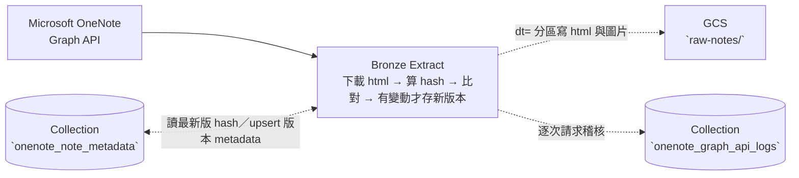

# Task07 v02 — OneNote Bronze ETL（Lazy Loading）

> 本文件是 **task07 Bronze 層專用的執行指引**，補足專案根目錄 high-level [`README.md`](../README.md) 未涵蓋的實作細節。

> task07 v02 是三層獨立服務加上一個共用套件的拆分架構：**[Bronze 下載(本資料夾)](README.md)**、[Silver enrich 服務](../task07_silver_service/README.md)、[Gold 歸檔/退件服務](../task07_gold_service/README.md)，與共用的 [tools](./task07_common/)。

> 本文只寫 Bronze 層服務。


# Purpose

- 從 Microsoft OneNote API 下載每一頁筆記的原文內嵌圖片。以 HTML 檔存放原文、以 PNG 檔存放圖片到 GCS 資料湖，其中，以日期分區辨識不同時間點下載的歷史版本。
- 把每個版本的中繼資料、資料血緣，以及每次 API 請求的稽核紀錄，寫入 MongoDB Atlas。
- 本層只做到下載、存檔與資料血緣的開端，接手的下游[Silver 服務](../task07_silver_service/README.md)負責透過 LLM 將筆記原文語意增強擴寫。


# Table of Contents
- [Purpose](#purpose)
- [DataFlow](#dataflow)
- [Project Structures](#project-structures)
- [Configuration](#configuration)
- [Schema of Collections (Tables) in Database of MongoDB Atlas](#schema-of-collections-tables-in-database-of-mongodb-atlas)
- [Data Source](#data-source)
- [Get Started](#get-started)
  - [(Option 1) Run on-premise without Docker Container](#option-1-run-on-premise-without-docker-container)


# DataFlow

從 Microsoft OneNote graph API 經過使用者 delegated authorization 獲取每一頁筆記的原文與內嵌圖片後，以 capture data change 設計模式判斷是否需要下載，下載時以 `dt=` 日期分區寫進 GCS 資料湖，其中筆記原始碼以 HTML 檔寫入、圖片以 PNG 檔寫入。過程中，API 請求與筆記的中繼資料、資料特徵、資料血緣適時寫入 MongoDB Atlas。



- **Extract**：
    - 以裝置流程（device flow）向 Azure 取得委派授權 (delegated authorization) 請求 graph API，由淺入深逐一走訪不同 endpoints，包含：筆記本、章節、頁面，直至取得頁面的 HTML 原始碼。
    > 委派授權交換得到的 token 快取於本機，腳本設有過期自動靜默刷新的機制。
    - CDC 判斷 HTML 原始碼經查演算雜湊法之後，與 metadata 表存放的既有雜湊比對，若雜湊不同才正式解析 (parsing) 原始碼，將原文寫入 GCS `raw-notes/.../dt=<執行日>/`。
    - 每個版本的來源 metadata（雜湊、GCS 路徑、圖片血緣、以頁面標題初判的主題）upsert 進 `onenote_note_metadata`、每次 API 請求嘗試則寫進 `onenote_graph_api_logs`。


# Project Structures

```plaintext
task07_onenote_to_markdown_lazy_loading/
├── main.py                # Bronze 入口：run_task07_bronze_etl()
├── e_onenote_download.py  # Extract：Graph API 下載、存入 GCS、upsert metadata
└── README.md              # 本文件

# 共用套件（見 ../task07_common/）
task07_common/
├── gcs.py         # GCS 資料湖讀寫、blob 路徑解析
├── audit_log.py   # MongoDB 稽核紀錄與筆記中繼資料讀寫
├── hashing.py     # HTML sha256
└── topic.py       # 以頁面標題初判 topic
```


# Configuration

- 執行 Bronze ETL 需要以下環境變數。
- **地端開發**：把 key/value 寫進專案根目錄 `.env`（複製 `.env.example` 後填入）。
- **雲端部署**：改存 GCP Secret Manager，容器啟動時注入為環境變數（見 [(Option 3)](#option-3-run-by-cloud-run-job)）。

| 變數名稱               | 說明                                                                | 預設值             | 必填 |
| ---------------------- | ------------------------------------------------------------------- | ----------------- | --- |
| `ONENOTE_CLIENT_ID`    | Azure App Registration Client ID（公用用戶端，Notes.Read scope）     | 無，需自訂         | ✅  |
| `MONGO_ALTAS_URI`      | MongoDB Atlas 連線字串                                              | 無，需自訂         | ✅  |
| `MONGO_DB_NAME`        | 目標 database 名稱                                                  | skill_dashboard | ✅  |
| `ENVIRONMENT`              | 執行環境名稱                                              |  無，需自訂<br>([只能賦值為 local、dev、或 prod 其中之一](../task07_common/audit_log.py))  |  ✅  |
| `GCS_USER_CREDENTIALS` | 寫入 `raw-notes/` 用的 GCS service account JSON key 檔路徑。 | 無，需自訂 | ✅ |
| `ONENOTE_GCS_BUCKET`              | 資料湖 bucket 名稱                                                  |  onenote-vaults  | 選填 (若未宣告此環境變數，腳本函式內亦預設使用 onenote-vaults，程式不會拋例外) |

> **如何取得 `ONENOTE_CLIENT_ID`**：Azure Portal → App registrations → 註冊一個「公用用戶端（行動與桌面）」應用程式、加入 `Notes.Read` 委派權限，複製其 Application (client) ID。首次執行會走裝置流程，終端機顯示一組代碼供在瀏覽器登入授權。

> **如何取得 `GCS_USER_CREDENTIALS`**：GCP Console → IAM & Admin → Service Accounts → 建立 SA、授予 `Storage Object User`（寫入 raw-notes）→ Keys → Add Key → JSON，下載後存到專案內（例如 `./env/gcs-user.json`），在 `.env` 設為此檔路徑。設好後，`task07_common/gcs.py` 會直接讀這個路徑連上 GCS。


# Schema of Collections (Tables) in Database of MongoDB Atlas

> `onenote_note_metadata` 是一張**橫跨 Bronze → Silver → Gold 逐步 upsert 的完整生命週期表**，Bronze 只負責寫入下方列出的欄位。

## Collection 1 — `onenote_graph_api_logs`

- 每筆 = 一次 Graph API 請求嘗試 `downloaded=false` 代表雜湊未變動而跳過存檔。

| **欄位名稱** | **欄位語意** | **資料型別** | **值來源** |
| :--- | :--- | :--- | :--- |
| `page_id` | OneNote 頁面 ID（若不是在 [fetch endpoint of content](#data-source) 則都會是 null） | String / null | `e_onenote_download.py` 的 `api_get()`／`download_notebooks()` |
| `timestamp` | 該次 attempt 的寫入時間 | Date (ISO 8601) | `task07_common/audit_log.py` 的 `log_api_call()` |
| `event_type` | 事件類型（固定 `onenote_api_download`） | String | `task07_common/audit_log.py` 的 `log_api_call()` |
| `method` | HTTP method（此 task 均為 GET） | String | `e_onenote_download.py` 的 `api_get()` |
| `api_endpoint` | 請求的 API endpoint | String | `e_onenote_download.py` 的 `api_get()` |
| `request_id` | 同一邏輯請求的追蹤 ID（retry 共用） | String | `e_onenote_download.py` 的 `api_get()`（`uuid.uuid4().hex[:12]`） |
| `attempt_id` | 第幾次嘗試（首次為 1） | Integer | `e_onenote_download.py` 的 `api_get()` |
| `status` / `status_code` | 該次 attempt 結果與 HTTP 碼（傳輸層錯誤記 0） | String / Integer | `e_onenote_download.py` 的 `api_get()`／`download_notebooks()` |
| `latency_ms` | 該次請求耗時（毫秒） | Integer | `e_onenote_download.py` 的 `api_get()` |
| `html_sha_hash` | 下載 HTML 原始碼的 sha256（變動判定 / enrichment 內容指紋） | String / null | `e_onenote_download.py` 的 `download_notebooks()` |
| `html_path` | HTML 寫入 GCS 的完整路徑 | String / null | `e_onenote_download.py` 的 `download_notebooks()` |
| `downloaded` | 本次是否實際寫入新版本到 GCS（雜湊相同則 false） | Bool | `e_onenote_download.py` 的 `download_notebooks()` |
| `environment` | 執行環境（local / dev / prod） | String | `task07_common/audit_log.py` 的 `log_api_call()` |
| `error_msg` | 錯誤訊息 (成功為 null) | String / null | `e_onenote_download.py` 的 `api_get()` |

## Collection 2 — `onenote_note_metadata`（Bronze 寫入的欄位）

- 每筆 = 一頁 OneNote 的**某一版本**
- 複合唯一鍵 (Upsert key)：`page_id + dt`。
- Bronze 階段寫入以下欄，其餘欄位由 Silver & Gold 任務 upsert：

| **欄位名稱** | **欄位語意** | **資料型別** | **值來源** |
| :--- | :--- | :--- | :--- |
| `page_id` | OneNote 頁面 ID（複合鍵之一） | String | `e_onenote_download.py` 的 `download_notebooks()` |
| `dt` | 下載日（複合鍵之一，同時是資料湖的 partition key） | String (`YYYY-MM-DD`) | `e_onenote_download.py` 的 `download_notebooks()` |
| `onenote_user_id` | 筆記使用者 id | String | `e_onenote_download.py` 的 `_extract_user_account()` |
| `notebook` / `section` / `page_title` | 筆記本 / 章節 / 頁面標題 | String | `e_onenote_download.py` 的 `download_notebooks()` |
| `html_sha_hash` | HTML 原始碼 sha256（變動判定 / enrichment 內容指紋） | String | `task07_common/hashing.py` 的 `html_source_hash()` |
| `html_md5_hash` | GCS html 物件 md5 | String | `task07_common/gcs.py` 的 `upload_text()` |
| `html_path` | html 在 GCS 的路徑 | String | `e_onenote_download.py` 的 `download_notebooks()` |
| `html_downloaded_at` | HTML 下載時間 | Date (ISO 8601) | `task07_common/audit_log.py` |
| `attached_images` | 圖片路徑血緣與 md5 hash | Array (Object) | `e_onenote_download.py` 的 `download_notebooks()` |
| `topic` | 以頁面標題初判的主題 | String | `task07_common/topic.py` 的 `infer_topic()` |
| `status` | 資料生命週期狀態 | String | `e_onenote_download.py` 的 `download_notebooks()` |
| `embedded_status` | 是否已向量化（Bronze 初始化 false，task08 翻 true） | Bool | `e_onenote_download.py` 的 `download_notebooks()` |
| `created_at` / `updated_at` | 建立 / 更新時間 | Date (ISO 8601) | `task07_common/audit_log.py` 的 `upsert_version_meta()` |

> status: Bronze 任務執行完之後只會分成 `bronze_stored` 與 `fetched_failed`，於 Silver / Gold 服務執行時，status 可有更多不同變化。

> Collection 1 & 2 實體關係圖 (Entity-Relationship Diagram) 可見 [根目錄 README 的 ERD 連結](../README.md#entity-relationship-diagram)。


# Data Source

Bronze 的資料來源是透過 Microsoft Graph API 存取 **個人 Microsoft OneNote**，您只需要開啟 OneNote APP 後建立任何筆記內容即會有資料可從 API 上獲取。無需額外下載準備 dataset。

| API 端點 | 用途 |
| -------- | ---- |
| `GET /me/onenote/notebooks` | 列出所有筆記本 |
| `GET /me/onenote/notebooks/{id}/sections` | 列出章節 |
| `GET /me/onenote/sections/{id}/pages` | 列出頁面清單 |
| `GET /me/onenote/pages/{id}/content` | 取得頁面 HTML |
| `GET {resource_url}` | 下載嵌入圖片 |


# Get Started

1. 準備一個 NoSQL 資料庫（MongoDB Atlas）。建立叢集、database user、Network Access 的步驟見根目錄 [`README.md`](../README.md)。
2. 在 Azure 註冊公用用戶端 App、取得 `ONENOTE_CLIENT_ID`（見 [Configuration](#configuration)）。
3. 依 [Configuration](#configuration) 設定環境變數。
> 此任務目前**僅設計為地端直接執行（Option 1）**，根據微軟官方網站聲明，OneNote API 目前僅開放 [delegated authentication，不支援 app-only authentication](https://learn.microsoft.com/zh-tw/graph/integrate-with-onenote)，因此以地端執行優先比較便利於當地使用者可同時使用瀏覽器授權給本地應用程式。

## (Option 1) Run on-premise without Docker Container

1. 建立 GCP service account、授予 `Storage Object User`，下載 JSON key 存到專案內（例如 `./env/gcs-user.json`），並在 `.env` 把 `GCS_USER_CREDENTIALS` 設為此檔路徑。
2. 在專案根目錄執行：

    ```bash
    poetry run python -m task07_onenote_to_markdown_lazy_loading.main
    ```

3. 首次執行時，終端機會印出一組網址與裝置授權碼；在瀏覽器登入 Microsoft 帳號、輸入該授權碼完成授權。Token 快取於本機（`~/.config/onenote-skill/token_cache.json`），之後執行會靜默刷新、不需再次授權。

4. 授權後您已可透過終端機互動確認要爬取哪邊篇筆記本的頁面，選擇後程式會自動判定是否需新寫入 GCS。
