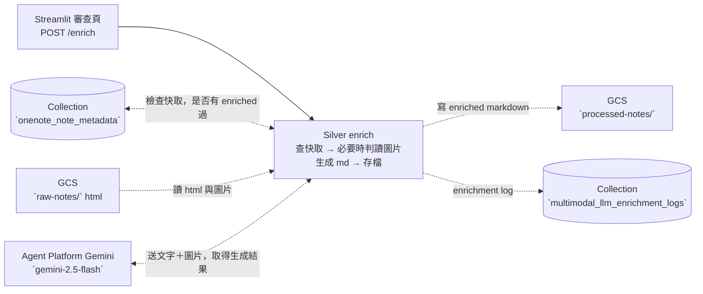

# Task07 v02 — Silver Enrich Service（On-demand，localhost:8002）

> 本文件是 **task07 Silver 服務專用的執行指引**，補足專案根目錄 high-level [`README.md`](../README.md) 未涵蓋的實作細節。

> task07 v02 是三層獨立服務加上一個共用套件的拆分架構：**[Bronze 下載](../task07_onenote_to_markdown_lazy_loading/README.md)**、[Silver enrich 服務(本資料夾)](./README.md)、[Gold 歸檔/退件服務](../task07_gold_service/README.md)，與共用的 [tools](./task07_common/)。

> 本文只寫 Silver 層服務。


# Purpose

- 提供一個 Flask 端點，接收審查頁對某一頁筆記某一版本的'文本語意擴寫增強 enrich 請求'。
- 把筆記的的 HTML 原始碼解析後，連同內嵌圖片送多模態LLM 判讀，生成 enriched 且冠上 frontmatter 的 Markdown 文檔，存到 GCS 資料湖。
- 更新該版本的文件生命週期狀態為 "待審查 (pending_review)"，寫入 MongoDB Atlas。
- 此外，每次 LLM call logs也會寫入 MongoDB Atlas。


# Table of Contents
- [Purpose](#purpose)
- [DataFlow](#dataflow)
- [Project Structures](#project-structures)
- [Configuration](#configuration)
- [Schema of Collections (Tables) in Database of MongoDB Atlas](#schema-of-collections-tables-in-database-of-mongodb-atlas)
- [Data Source](#data-source)
- [Get Started](#get-started)
  - [(Option 1) Run on-premise without Docker Container](#option-1-run-on-premise-without-docker-container)
  - [(Option 2) Run on-premise with Docker Container](#option-2-run-on-premise-with-docker-container)
  - [(Option 3) Run as Cloud Run Service](#option-3-run-as-cloud-run-service)

---

# DataFlow

Silver 服務是**純 Lazy Loading**，它不被設計為定時觸發的 ETL 批次任務，而是於前端網頁開放按鈕點選送出請求給 Silver 服務端口。當審查頁 POST 一個 `{page_id, dt, trigger}`，Silver 服務會依序執行：MongoDB Atlas 檢查快取資料、無快取資料預存，打 LLM 語意增強擴寫筆記文本、把 enriched 文本以 Markdown 檔存到 GCS 層 、回頭更新 metadata，標記檔案存放路徑以及該 enriched 文本尚待審查。



- **端點**：接收 request.post 後，解析request body 的 `page_id`、`dt`、`trigger`，判斷是否要回覆 400、404、500 或 200。
- **Transform（當回應 200 時會執行）**：
    - 檢查快取: 先讀該版本筆記在 `onenote_note_metadata` 是否指向一份之前生成過的 Markdown，若無則會進入 LLM call 步驟，若有則不花費 token 、沿用該 Markdown 內文回傳給前端檢視內文。
    - 以斷路器檢查 LLM call 額度剩餘量。
    - 有剩餘額度，將從 GCS 下載 HTML、把 tag `` 轉成 Markdown 圖片語法並取純文字，連同圖片的 GCS URI 一起送入多模態 LLM，要求模型實際判讀每張圖並回傳結構化 JSON。
    - 剖析 JSON 取出 enriched 文本。
    > 生成額度預設 2 次/per-note。
- **Load**：將生成之文本寫到 GCS `processed-notes/.../dt=<對齊 Bronze 執行日>/<page>.md`，然後更新 MongoDB Atlas。
    - 更新中繼資料時，upsert 到 collection `onenote_note_metadata`。
    - 每次呼叫都 insert 一筆 enrichment log 到 collection `multimodal_llm_enrichment_logs`。


# Project Structures

```plaintext
task07_silver_service/
├── app.py                       # Flask 端點：POST /enrich（localhost:8002）
├── t_enrich_html_to_markdown.py # Transform：查快取、呼叫多模態 LLM 生成 markdown
├── l_save_markdown.py           # Load：markdown 寫入 GCS 並更新 metadata
└── README.md                    # 本文件

# 共用套件（見 ../task07_common/）：gcs.py / audit_log.py / hashing.py / topic.py
```


# Configuration

- 執行 Silver 服務需要以下環境變數。
- **地端開發**：把 key/value 寫進專案根目錄 `.env`（複製 `.env.example` 後填入）。
- **雲端部署**：改存 GCP Secret Manager，容器啟動時注入為環境變數（見 [(Option 3)](#option-3-run-as-cloud-run-service)）。

| 變數名稱                          | 說明                                                                | 預設值             | 必填 |
| --------------------------------- | ------------------------------------------------------------------- | ----------------- | --- |
| `MONGO_ALTAS_URI`                 | MongoDB Atlas 連線字串                                              | 無，需自訂         | ✅  |
| `MONGO_DB_NAME`                   | 目標 database 名稱                                                  | skill_dashboard | ✅  |
| `GCP_PROJECT_ID`                  | Agent Platform 專案 ID                      | 無，需自訂         | ✅  |
| `AGENT_PLATFORM_USER_CREDENTIALS` | **地端執行時**才需要：呼叫 Agent Platform Gemini 用的 service account JSON key 檔路徑。雲端執行不需要此變數 | 無，地端需自訂 | 地端 ✅ |
| `GCS_USER_CREDENTIALS`            | **地端執行時**才需要：讀 `raw-notes/` html、寫 `processed-notes/` md 用的 GCS service account JSON key 檔路徑。雲端執行不需要此變數。 | 無，地端需自訂 | 地端 ✅ |
| `ONENOTE_GCS_BUCKET`              | 資料湖 bucket 名稱                                                  |  onenote-vaults  | 選填 (若不定義此環境變數，腳本函式內亦預設傳入 onenote-vaults) |

> **如何備妥 service account JSON key**：GCP Console → IAM & Admin → Service Accounts → 建立 SA（GCS 讀寫授予 `Storage Object User`；Agent Platform 授予 `Agent Platform User`）→ Keys → Add Key → JSON，下載後存到專案內（例如 `./env/`），在 `.env` 填入 JSON key 檔的路徑。


# Schema of Collections (Tables) in Database of MongoDB Atlas

> `onenote_note_metadata` 是一張**橫跨 Bronze → Silver → Gold 逐步 upsert 的完整生命週期表**，Silver 只負責寫入下方列出的欄位。

## Collection 1 — `multimodal_llm_enrichment_logs`

- 每筆 = 一次 LLM 呼叫歷程、或是不呼叫 LLM 而改用快取 enriched 文本的紀錄。

| **欄位名稱** | **欄位語意** | **資料型別** | **值來源** |
| :--- | :--- | :--- | :--- |
| `page_id` | OneNote 頁面 ID | String | `t_enrich_html_to_markdown.py` 的 `t_enrich_html_to_markdown()` |
| `html_sha_hash` | 該版本 HTML 的 sha256 | String | `t_enrich_html_to_markdown.py` 的 `t_enrich_html_to_markdown()` |
| `timestamp` | 此筆 log 寫入 MongoDB 的時間 | Date (ISO 8601) | `task07_common/audit_log.py` 的 `log_enrichment_call()` |
| `event_type` | 事件類型（固定 `llm_enrichment_call`） | String | `task07_common/audit_log.py` 的 `log_enrichment_call()` |
| `model` | 使用的 LLM 模型 | String | `t_enrich_html_to_markdown.py` 的 `t_enrich_html_to_markdown()` |
| `cache_hit` | 是否能取得快取 (=沿用生成過的 md)? | Bool | `t_enrich_html_to_markdown.py` 的 `t_enrich_html_to_markdown()` |
| `trigger` | 觸發原因（on_demand / regenerate） | String | `t_enrich_html_to_markdown.py` 的 `t_enrich_html_to_markdown()` |
| `status` | 該次結果（success / failure） | String | `t_enrich_html_to_markdown.py` 的 `t_enrich_html_to_markdown()` |
| `input_tokens` / `output_tokens` / `total_tokens` | 消耗的 token 數；使用快取時均為 0；應呼叫但呼叫失敗時為 null | Int32 / null | `t_enrich_html_to_markdown.py` 的 `_call_llm()` |
| `latency_ms` | LLM 呼叫耗時 | Int32 | `t_enrich_html_to_markdown.py` 的 `t_enrich_html_to_markdown()` |
| `environment` | 執行環境（local / dev / prod） | String | `task07_common/audit_log.py` 的 `log_enrichment_call()` |
| `error_msg` | 錯誤訊息 | String / null | `t_enrich_html_to_markdown.py` 的 `t_enrich_html_to_markdown()` |

## Collection 2 — `onenote_note_metadata`

| **欄位名稱** | **欄位語意** | **資料型別** | **值來源** |
| :--- | :--- | :--- | :--- |
| `enriched_md_path` | enriched 後的 md 在 GCS 的路徑 | String | `task07_silver_service/l_save_markdown.py` 的 `save_enriched_md()` |
| `md_md5_hash` | enriched 後的 md 的 GCS md5 | String | `task07_common/gcs.py` 的 `upload_text()` |
| `enriched_md_exported_at` | enriched md 匯出時間 | Date (ISO 8601) | `task07_common/audit_log.py` 的 `now_utc()` |
| `status` | 資料生命週期狀態 | String | `t_enrich_html_to_markdown.py` 的 `t_enrich_html_to_markdown()` |
| `error_msg` | 錯誤訊息（成功為 null） | String / null | `t_enrich_html_to_markdown.py` 的 `t_enrich_html_to_markdown()` |
| `updated_at` | 更新時間 | Date (ISO 8601) | `task07_common/audit_log.py` 的 `upsert_version_meta()` |

> status: LLM call 執行順利時，status 將會從 `bronze_stored` 變化成 `fetched`、然後`pending_review`。若失敗，則從 `bronze_stored` 變化成 `fetched`，最後 `fetched_failed`。此欄位在 Gold 服務執行時，status 將覆蓋上新的值。

> Collection 1 & 2 實體關係圖 (Entity-Relationship Diagram) 可見 [Lucid chart](https://lucid.app/lucidchart/63122cc4-527c-4823-b570-ec85cf7452c3/edit?viewport_loc=-31618%2C-6610%2C5638%2C3022%2C0_0&invitationId=inv_318a6fdc-8972-40a9-a3ee-1de9ae651949)。

# Data Source

Silver 沒有獨立的原始資料，它的輸入來自 **Bronze 的產出** 與**審查頁的觸發**：

| 來源 | 角色 |
| ---- | ---- |
| MongoDB `onenote_note_metadata` | 讀某版本的內容雜湊、圖片血緣 |
| GCS `raw-notes/`（Bronze html） | 依 metadata 下載該版本 HTML 與圖片 |
| Streamlit 審查頁 `POST /enrich` | 觸發：帶 `page_id + dt + trigger` 指定要 enrich 哪個版本 |

**執行前置**：先跑過 [Bronze ETL](../task07_onenote_to_markdown_lazy_loading/) 產生 `raw-notes/` html 與 metadata，Silver 才有版本可 enrich。


# Get Started

1. 準備 MongoDB Atlas（見根目錄 [`README.md`](../README.md)），並先跑過 Bronze 層任務。
2. 依 [Configuration](#configuration) 設定環境變數。
3. 以下三種方式擇一啟動服務。服務啟動後，審查頁以 `POST /enrich` 觸發。

測試端點範例：

```bash
curl -X POST http://localhost:8002/enrich \
    -H "Content-Type: application/json" \
    -d '{"page_id": "0-c69860f9...", "dt": "2026-07-01", "trigger": "on_demand"}'
```

## (Option 1) Run on-premise without Docker Container

1. 建立兩個 GCP service account：一個授予 `Storage Object User`（讀 html／寫 processed md），一個授予 `Agent Platform User`（呼叫 LLM）；各下載 JSON key 存到專案內（例如 `./env/`），並在 `.env` 分別把 `GCS_USER_CREDENTIALS`、`AGENT_PLATFORM_USER_CREDENTIALS` 設為對應路徑。
2. 在專案根目錄啟動 Flask 服務（監聽 8002）：

    ```bash
    poetry run python -m task07_silver_service.app
    ```

## (Option 2) Run on-premise with Docker Container

1. 完成 Option 1 的步驟 1（兩個 SA JSON key）。
2. 確認 Docker Desktop 已安裝且 daemon 執行中。
3. 從根目錄 build image：

    ```bash
    cd 06_personnel_skill_library

    docker build \
        -f docker/Dockerfile.task07_silver_service \
        -t task07-silver-service:latest .
    ```

4. 啟動 container（掛入 `.env`、把 JSON key 以 volume 掛入、對外開 8002）：

```bash
docker run --rm --env-file ./.env \
    -v "$(pwd)/env:/app/env:ro" \
    -p 8002:8080 \
    --name task07-silver-service \
    task07-silver-service:latest
```

## (Option 3) Run as Cloud Run Service

1. **Service Account**：使用 `psd-enrich-task`，授予 `Agent Platform User`、`Storage Object User`、`Secret Manager Secret Accessor`。
2. **Secret Manager**：把 `MONGO_ALTAS_URI`、`MONGO_DB_NAME`、`GCP_PROJECT_ID`（及選填 `ONENOTE_GCS_BUCKET`）存為 secrets。
3. **Build image**（Cloud Run 監聽的 port 需在容器內對齊，通常改對外 8080）：

    ```bash
    docker build --platform=linux/amd64 \
        -f docker/Dockerfile.task07_silver_service \
        -t task07-silver-service:latest .
    ```

> 建議加上 `--platform=linux/amd64`：Cloud Run 執行環境通常是 linux/amd64，若您在非 amd64 機器（如 Apple Silicon arm64）build image，不指定平台會導致 Cloud Run 無法啟動 container。

4. **Push 到 Artifact Registry**、**建立 Cloud Run Service**、掛載 secrets、指定 `psd-enrich-task`。
5. 取得服務 URL 後，把它設給 dashboard 的 `SILVER_ENDPOINT_URL`（本機預設 `http://localhost:8002/enrich`），審查頁即可呼叫。
