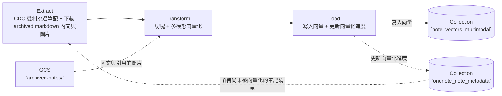

# Task08 — OneNote Vector DB ETL

> 本文件是 **task08 專用的執行指引**，補足專案根目錄 high-level [`README.md`](../README.md) 未涵蓋的實作細節。
> 環境安裝的「共用前置」（pyenv + Poetry、MongoDB Atlas 帳號、Docker Desktop）請見根目錄 [`README.md`](../README.md)。


# Purpose

將 [task07](../task07_gold_service/) 已歸檔的 OneNote 筆記中向量化之後存入向量資料庫，供 [dashboard 的 AI 知識 Agent](../dashboard_ui/pages/ai_knowledge_agent.py) 做 RAG。


# Table of Contents

- [Purpose](#purpose)
- [DataFlow](#dataflow)
- [Project Structures](#project-structures)
- [Configuration](#configuration)
- [Schema of Collections (Tables) in Database of MongoDB Atlas](#schema-of-collections-tables-in-database-of-mongodb-atlas)
- [Data Source](#data-source)
- [Get Started](#get-started)
  - [(Option 1) Run on-premise without Docker Container](#option-1-run-on-premise-without-docker-container)
  - [(Option 2) Run on-premise with Docker Container](#option-2-run-on-premise-with-docker-container)
  - [(Option 3) Run by Cloud Run Job](#option-3-run-by-cloud-run-job)

---

# DataFlow

主要邏輯是從 [task07](../task07_gold_service/README.md) 已歸檔、尚未向量化的 OneNote 筆記中挑出待處理者，執行資料切塊、向量化，最終寫入 MongoDB Atlas 的 `note_vectors_multimodal`。



- **Extract**：以 CDC 機制下載筆記內文。
    - 從 `onenote_note_metadata` 挑出狀態為 *已歸檔*、但向量化狀態標示為 *未完成* 的筆記，依其歸檔路徑從 GCS 的`archived-notes/` 下載筆記內文 (markdown file)。
- **Transform**：以送入 embedding model 為導向進行內文清理出 chunks 後向量化。
    - 把內文兩段式切塊，先依 markdown 標題階層切、再依文字長度切。
    - 將每個 chunk 連同其引用圖片的 GCS URI 一起送多模態模型，輸出 1536 維單位向量的 embed。

- **Load**：以 'delete 後 insert' 模式將 embed 更新至向量資料庫。再回頭 update 筆記向量化完成狀態。
    - 對每份筆記，先刪去它在 `note_vectors_multimodal` 的舊向量、再插入新向量 (以避免同名筆記在重複執行本 ETL 後，殘留前次執行留下的 chunks，造成數據孤兒)。
    - 採用 'compare-and-swap' 策略，比對這次下載的筆記 hash 是否與 `onenote_note_metadata` 登記的 hash 相符，相符則該筆記在 `onenote_note_metadata` 的向量化狀態更新為 '已完成'。
        > 若您的 task07 silver 與 task08 任務批次執行時間沒有重疊，或是沒有其他 tasks 在 task08 執行期間可能覆蓋 GCS 上的筆記，則 'compare-and-swap' 的執行結果通常都是導向為 '已完成'。

---

# Project Structures

```plaintext
task08_onenote_embed_etl/
├── main.py                # 入口：run_task08()
├── e_scan_metadata.py     # Extract：以 CDC 判斷後下載筆記內文
├── t_chunk_embed.py       # Transform：資料切塊、多模態資料向量化
└── l_load_to_mongodb.py   # Load：先刪後插入 embed
```

---

# Configuration

- 執行 task08 需要以下環境變數。
- **地端開發**：把 key/value 寫進專案根目錄 `.env`（複製 `.env.example` 後填入）。
- **雲端部署**：改存 GCP Secret Manager，容器啟動時注入為環境變數（見 [(Option 3)](#option-3-run-by-cloud-run-job)）。

| 變數名稱                          | 說明                                                                | .env.example 預設值             | 必填 |
| --------------------------------- | ------------------------------------------------------------------- | ----------------- | --- |
| `MONGO_ALTAS_URI`                 | MongoDB Atlas 連線字串                                              | 無，需自訂         | ✅  |
| `MONGO_DB_NAME`                   | 目標 database 名稱                                                  | skill_dashboard | ✅  |
| `GCP_PROJECT_ID`                  | 專案 ID（與 Agent Platform 互動）                    | 無，需自訂         | ✅  |
| `GCS_USER_CREDENTIALS`            | **地端執行時**才需要：讀取 `archived-notes/` 內文與圖片用的 GCS service account JSON key 檔路徑。雲端執行時不需此變數。 | 無，地端需自訂 | 地端 ✅ |
| `AGENT_PLATFORM_USER_CREDENTIALS` | **地端執行時**才需要：呼叫 Agent Platform 的 embedding model 用的 service account JSON key 檔路徑。雲端執行時不需此變數。 | 無，地端需自訂 | 地端 ✅ |
| `ONENOTE_GCS_BUCKET`              | 資料湖 bucket 名稱                                                  |  onenote-vaults  | 選填 (若不定義此環境變數，腳本函式內亦預設傳入 onenote-vaults) |

> **如何取得 service account JSON key**：GCP Console → IAM & Admin → Service Accounts → 建立 SA（GCS_USER 讀取授予 `Storage Object Viewer`；AGENT_PLATRORM_USER 授予 `Agent Platform User`）→ Keys → Add Key → JSON，下載後存到專案內（例如 `./env/`）。

> **地端執行的憑證接線**（地端執行需解除兩處註解）：
> - **GCS**：取消 [main.py](./main.py) 的 `if __name__ == "__main__"` 下方區塊的註解後，程式會把 `GCS_USER_CREDENTIALS` 的路徑寫進 `GOOGLE_APPLICATION_CREDENTIALS`，`storage.Client()` 便會觸發 ADC 機制、讀取這個 JSON key。
> - **Agent Platform**：取消 [t_chunk_embed.py](./t_chunk_embed.py) 的 `_get_genai_client()` 中「地端測試跑下面區塊」的註解後，程式便會從 `AGENT_PLATFORM_USER_CREDENTIALS` 讀取憑證來連上 Agent Platform。


# Schema of Collections (Tables) in Database of MongoDB Atlas

## Collection — `note_vectors_multimodal`

- OneNote 筆記的向量資料存放表。
- 每筆 = 一份筆記的一個 chunk。
> 以 `md_path` 欄位值一對一對齊 `onenote_note_metadata` 的 `archived_md_path`。

| **欄位名稱** | **欄位語意** | **資料型別** | **值來源** |
| :--- | :--- | :--- | :--- |
| `_id` | MongoDB 自動生成的唯一識別碼 (Primary key) | ObjectId | MongoDB 自動產生 |
| `md_path` | 筆記歸檔在 GCS 的路徑 | String | `onenote_note_metadata` 的 `archived_md_path` |
| `file_name` | 筆記檔名 | String | 歸檔 md 檔名 |
| `chunk_index` | 此 chunk 在筆記中的序號 | Integer | Transform 向量化產出 |
| `chunk_total` | 該筆記的總 chunk 數 | Integer | Transform 向量化產出 |
| `tags` | 筆記標籤 | Array (String) | `onenote_note_metadata` 的 `md_frontmatter.tags` |
| `note_type` | 筆記類型 | String | `onenote_note_metadata` 的 `md_frontmatter.type` |
| `date` | 筆記日期 | Date (ISO 8601) \| null | `onenote_note_metadata` 的 `md_frontmatter.date`（無有效日期時為 null） |
| `section` | chunk 在內文所屬的標題路徑 | String | Transform 的切塊函式 |
| `content` | chunk 原始文字 | String | Transform 的切塊函式 |
| `image_paths` | 該 chunk 引用圖片在 archived layer 的路徑 | Array (String) | Transform 解析 chunk 內圖片路徑後產出 |
| `embedding` | 1536 維多模態單位向量 | Array (Float) | Transform 的向量化函式 |

> tags 與 note_type 可在 RAG 搜索方案中，留作 prefiler by keyword search 的手段。視開發需求修改[腳本](../dashboard_ui/agent_tools/query_with_vector_search.py)。

> **Index**：*務必* 建立 Vector Search index，設定如下:
    ```json
    {
    "fields": [
        {
        "type": "vector",
        "path": "embedding",
        "numDimensions": 1536,
        "similarity": "cosine"
        }
    ]
    }
    ```

- example of a row in JSON

```json
{
  "_id": ObjectId("6a6304..."),
  "md_path": "gs://onenote-vaults/archived-notes/.../dt=2026-07-08/CHO Cell代謝.md",
  "file_name": "CHO Cell代謝",
  "chunk_index": 0,
  "chunk_total": 5,
  "tags": ["cho-cell", "tca-cycle", "warburg-effect", "dhfr"],
  "note_type": "knowledge-summary",
  "date": ISODate("2026-07-08T00:00:00.000+0000"),
  "section": "CHO Cell 代謝 > Lactate > 糖質新生",
  "content": "### 糖質新生  \n*   相當耗能，需消耗 6 ATP。  \n  \nAI生成圖釋:\n此圖示列出了糖質新生（Gluconeogenesis）的幾種前驅物。\n這些前驅物包括乳酸（Lactate）、丙胺酸（Alanine）和甘油（Glycerol）。",
  "image_paths": [
    "gs://onenote-vaults/archived-notes/lucky460721/生技製劑筆記本/General technical knowledge/dt=2026-07-08/_images/0-6405132e916140c3ac8e2cbdc585c9f0!1-A5F7F5395D4FB9F!209.png"
  ],
  "embedding": [0.01, -0.02, ..., 0.0312] // 長度等同 vector dimension
}
```
> Collection 與其他 tasks 的 collection 實體關係圖 (Entity-Relationship Diagram) 可見 [Lucid chart](https://lucid.app/lucidchart/63122cc4-527c-4823-b570-ec85cf7452c3/edit?viewport_loc=-31618%2C-6610%2C5638%2C3022%2C0_0&invitationId=inv_318a6fdc-8972-40a9-a3ee-1de9ae651949)。

# Data Source

task08 資料來自 **task07 gold service 的執行結果**，您應該先開通 [task07 服務](../task07_gold_service/app.py) 並透過 [UI 操作成功](../dashboard_ui/pages/onenote_review.py)至少一次後。以及[成功建立 Vector Search Index](#collection--note_vectors_multimodal)，此三項操作後再執行 task08。


# Get Started

1. 準備一個 NoSQL 資料庫（MongoDB Atlas）。建立叢集、database user、Network Access 的步驟見根目錄 [`README.md`](../README.md)。
2. 依 [Data Source](#data-source) 完成前置作業確保有資料可進行向量化。
3. 依 [Configuration](#configuration) 設定環境變數。
4. 以下三種方式擇一執行。

## (Option 1) Run on-premise without Docker Container

1. 建立兩個 GCP service account：一個授予 `Storage Object Viewer`，一個授予 `Agent Platform User`。
2. 各下載 JSON key 存到專案內（例如 `./env/`），並在 `.env` 分別把 `GCS_USER_CREDENTIALS`、`AGENT_PLATFORM_USER_CREDENTIALS` 設為對應路徑。
3. 依 [Configuration](#configuration) 的「地端執行的憑證接線」指示解除腳本中的註解。
4. 在專案根目錄執行：

    ```bash
    poetry run python -m task08_onenote_embed_etl.main
    ```

## (Option 2) Run on-premise with Docker Container

1. 完成 Option 1 的[步驟 1–2](#option-1-run-on-premise-without-docker-container)。
2. 確認 Docker Desktop 已安裝且 daemon 執行中。
3. 從根目錄 build image：

    ```bash
    cd 06_personnel_skill_library

    docker build \
        -f docker/Dockerfile.task08 \
        -t task08-onenote-embed-etl:latest .
    ```

4. 啟動 container（掛入 `.env`，並把兩個 JSON key 檔以 volume 掛進容器）：

    ```bash
    docker run --rm --env-file ./.env \
        -v "$(pwd)/env:/app/env:ro" \
        --name task08-onenote-embed-etl \
        task08-onenote-embed-etl:latest
    ```

## (Option 3) Run by Cloud Run Job

1. **Service Account**： 建立帳號名稱 `psd-embedding-task` 授予 `Agent Platform User`、`Storage Object Viewer`、`Secret Manager Secret Accessor` 與 `Cloud Run Developer` 四種角色。
2. **Secret Manager**：把 `MONGO_ALTAS_URI`、`MONGO_DB_NAME`、`GCP_PROJECT_ID`、 `(選填的)ONENOTE_GCS_BUCKET` 存為 secrets。
3. **Build image**：

    ```bash
    docker build --platform=linux/amd64 \
        -f docker/Dockerfile.task08 \
        -t task08-onenote-embed-etl:latest .
    ```

    > 建議加上 `--platform=linux/amd64`：Cloud Run 執行環境通常是 linux/amd64，若您在非 amd64 機器（如 Apple Silicon arm64）build image，不指定平台會導致 Cloud Run 無法啟動 container。

4. **Push 到 Artifact Registry**：

    ```bash
    docker push <location>-docker.pkg.dev/<GCP_PROJECT_ID>/<AR_repo_name>/task08-onenote-embed-etl:latest
    # 例：
    # docker push asia-east1-docker.pkg.dev/causal-inquiry-484423-e7/personal-skill-dashboard/task08-onenote-embed-etl:latest
    ```

5. **建立 Cloud Run Job**：指定上述 image、掛載 Secret Manager secrets 為環境變數、`Security` 分頁的 `Identity to be used by the job` 填 `psd-embedding-task`。部署流程參考 [官方指引](https://docs.cloud.google.com/run/docs/quickstarts/jobs/create-execute?hl=zh-tw)。

6. 手動觸發一次確認 `note_vectors_multimodal` 有向量寫入，之後以 **Cloud Scheduler** 定期觸發。
> 建議額外創一支單純的 service account `cloud-scheduler-trigger`，僅給予 `Cloud Run Developer` 角色。
> 建議排在 task07 歸檔之後執行，向量才會跟上最新歸檔的版本。

> **若您 fork 本專案分支**：repository 內已備好 GitHub Actions workflow（`.github/workflows/deploy_task08_onenote_embed_etl.yml`），當 push 到 `develop` 且 `task08_onenote_embed_etl/**` 或 `docker/Dockerfile.task08` 有變動時，會自動 build image、push 到 Artifact Registry 並 deploy 到 Cloud Run Job。要啟用它，需自行在 GCP 申請 Workload Identity Federation（讓 GitHub Actions 免存 SA JSON key 即可認證 GCP）。若您不打算 fork，忽略本註即可——上述 1–6 步手動流程已足夠。
